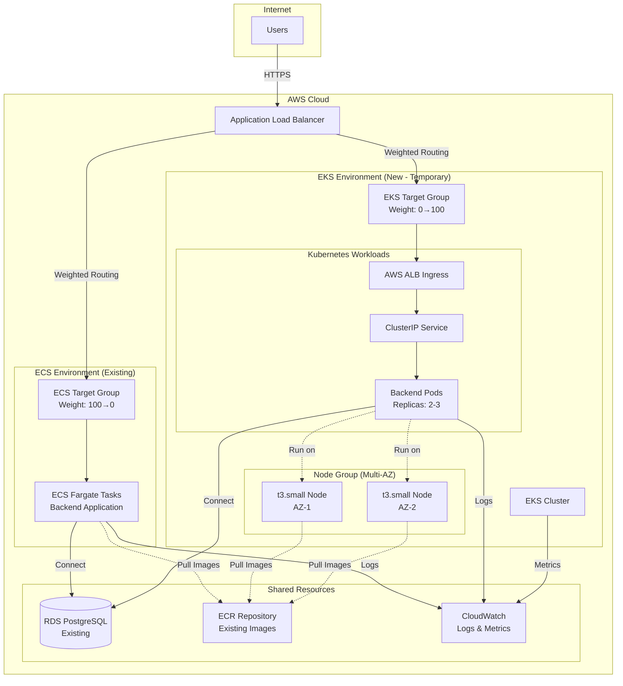
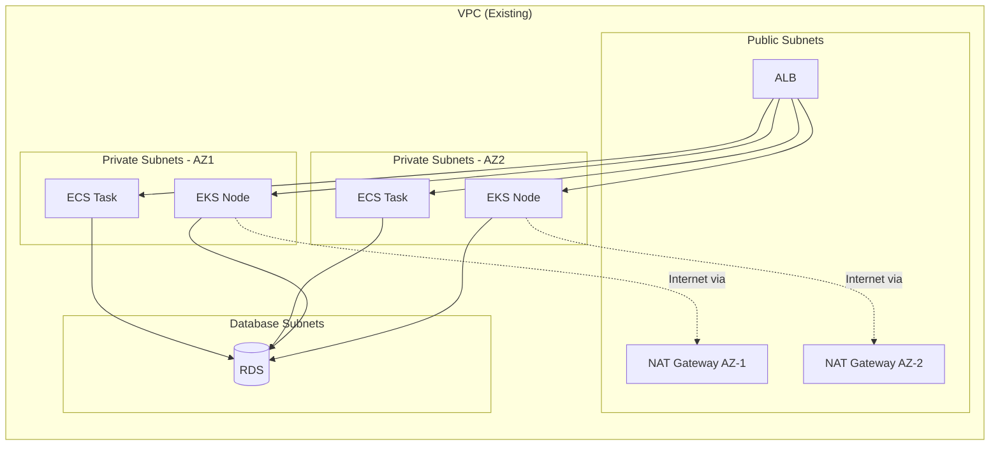
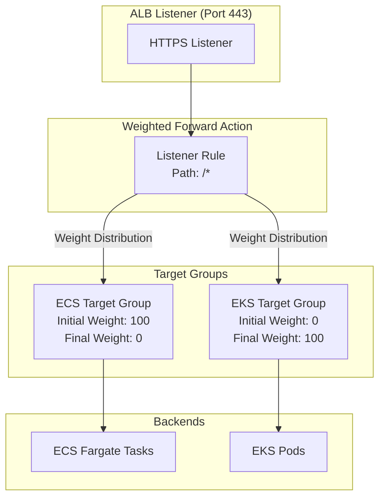
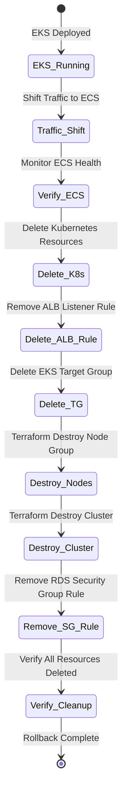

# Design Document: EKS Migration Guide

## Overview

This design document provides a comprehensive technical architecture for temporarily migrating a backend application from Amazon ECS (Fargate) to Amazon EKS for exploration purposes. The design emphasizes modularity, allowing EKS components to be deployed alongside existing ECS infrastructure and cleanly removed without impact.

The solution provides two deployment paths:
1. **Automated Terraform deployment** - for rapid provisioning and infrastructure-as-code benefits
2. **Manual AWS Console deployment** - for learning and understanding each component

The architecture maintains the existing ECS deployment as the primary production environment while EKS runs in parallel for testing. Traffic routing is controlled through ALB weighted target groups, enabling gradual traffic shifting and instant rollback.

**Key Design Principles:**
- **Isolation**: EKS resources are completely separate from ECS infrastructure
- **Reversibility**: All changes can be rolled back without affecting ECS
- **Cost-consciousness**: Optimized for AWS free tier during one-week exploration
- **Production-ready patterns**: Follows AWS Well-Architected Framework despite temporary nature
- **Learning-focused**: Detailed explanations and manual steps for educational value

## Architecture

### High-Level Architecture




### Architecture States

**State 1: Pre-Migration (Current State)**
- ALB routes 100% traffic to ECS target group
- ECS Fargate tasks run backend application
- RDS PostgreSQL serves as database
- ECR stores container images

**State 2: During Migration (Parallel Deployment)**
- EKS cluster deployed alongside ECS
- ALB routes traffic to both ECS and EKS using weighted target groups
- Traffic weight gradually shifts: ECS 100%→0%, EKS 0%→100%
- Both environments share RDS database and ECR images
- CloudWatch monitors both environments

**State 3: Post-Rollback (Return to Original)**
- ALB routes 100% traffic back to ECS target group
- EKS resources completely removed via Terraform destroy
- ECS environment unchanged and fully operational
- No residual EKS costs or resources


### Network Architecture



**Network Design Decisions:**

1. **VPC Reuse**: EKS uses existing VPC and subnets (no new network infrastructure)
   - *Well-Architected: Cost Optimization* - Avoids duplicate networking costs
   - *Well-Architected: Operational Excellence* - Reduces complexity

2. **Multi-AZ Deployment**: EKS nodes span multiple availability zones
   - *Well-Architected: Reliability* - Maintains availability during AZ failures
   - Matches existing ECS multi-AZ pattern

3. **Private Subnets**: EKS nodes deployed in private subnets with NAT gateway access
   - *Well-Architected: Security* - Nodes not directly exposed to internet
   - *Well-Architected: Security* - Outbound internet via NAT for image pulls

4. **Shared Database Subnets**: RDS remains in isolated database subnets
   - *Well-Architected: Security* - Database isolation maintained
   - No changes to existing database network configuration


## Components and Interfaces

### EKS Cluster Configuration

**Cluster Specifications:**
```yaml
cluster_name: "backend-eks-exploration"
kubernetes_version: "1.28"  # Latest stable version
endpoint_access:
  public: true   # For kubectl access during exploration
  private: true  # For node-to-control-plane communication
enabled_cluster_log_types:
  - "api"
  - "audit"
  - "authenticator"
  - "controllerManager"
  - "scheduler"
```

**Design Rationale:**
- *Well-Architected: Security* - Both public and private endpoint access allows secure kubectl access while maintaining private node communication
- *Well-Architected: Operational Excellence* - All log types enabled for comprehensive troubleshooting
- *Well-Architected: Cost Optimization* - Single cluster for exploration (not multi-cluster)

### Node Group Configuration

**Node Group Specifications:**
```yaml
node_group_name: "backend-nodes"
instance_types:
  - "t3.small"      # Primary: 2 vCPU, 2 GB RAM
  - "t3.micro"      # Fallback: 2 vCPU, 1 GB RAM (free tier eligible)
capacity_type: "ON_DEMAND"  # Not SPOT for stability during exploration
scaling_config:
  desired_size: 2
  min_size: 2
  max_size: 3
disk_size: 20  # GB, minimum for container images
ami_type: "AL2_x86_64"  # Amazon Linux 2
labels:
  environment: "exploration"
  workload: "backend"
taints: []  # No taints for simple deployment
```

**Design Rationale:**
- *Well-Architected: Reliability* - Minimum 2 nodes across AZs for high availability
- *Well-Architected: Cost Optimization* - t3.small balances cost and performance; t3.micro as fallback for free tier
- *Well-Architected: Performance Efficiency* - 2 vCPU per node sufficient for backend workload
- *Well-Architected: Sustainability* - Right-sized instances avoid over-provisioning

**Resource Capacity Planning:**
- Each t3.small node: 2 vCPU, 2 GB RAM
- System pods (kube-proxy, aws-node, coredns): ~0.5 vCPU, ~500 MB RAM per node
- Available for application: ~1.5 vCPU, ~1.5 GB RAM per node
- Backend pod requirements: 0.5 vCPU, 512 MB RAM (matching ECS task)
- Capacity: 2 nodes can run 4-5 backend pods comfortably


### Kubernetes Resources

#### Namespace

```yaml
apiVersion: v1
kind: Namespace
metadata:
  name: backend
  labels:
    name: backend
    environment: exploration
```

**Design Rationale:**
- *Well-Architected: Operational Excellence* - Namespace isolation for backend application
- Enables resource quotas and network policies if needed

#### Deployment

```yaml
apiVersion: apps/v1
kind: Deployment
metadata:
  name: backend-api
  namespace: backend
  labels:
    app: backend-api
    version: v1
spec:
  replicas: 2  # Matches ECS desired count
  strategy:
    type: RollingUpdate
    rollingUpdate:
      maxSurge: 1
      maxUnavailable: 0  # Zero-downtime updates
  selector:
    matchLabels:
      app: backend-api
  template:
    metadata:
      labels:
        app: backend-api
        version: v1
    spec:
      affinity:
        podAntiAffinity:
          preferredDuringSchedulingIgnoredDuringExecution:
          - weight: 100
            podAffinityTerm:
              labelSelector:
                matchExpressions:
                - key: app
                  operator: In
                  values:
                  - backend-api
              topologyKey: kubernetes.io/hostname
      containers:
      - name: backend
        image: ${AWS_ACCOUNT_ID}.dkr.ecr.${AWS_REGION}.amazonaws.com/backend:latest
        ports:
        - containerPort: 3000
          name: http
          protocol: TCP
        env:
        - name: NODE_ENV
          value: "production"
        - name: PORT
          value: "3000"
        - name: DB_HOST
          valueFrom:
            secretKeyRef:
              name: backend-secrets
              key: db_host
        - name: DB_PORT
          value: "5432"
        - name: DB_NAME
          valueFrom:
            secretKeyRef:
              name: backend-secrets
              key: db_name
        - name: DB_USER
          valueFrom:
            secretKeyRef:
              name: backend-secrets
              key: db_user
        - name: DB_PASSWORD
          valueFrom:
            secretKeyRef:
              name: backend-secrets
              key: db_password
        - name: JWT_SECRET
          valueFrom:
            secretKeyRef:
              name: backend-secrets
              key: jwt_secret
        resources:
          requests:
            cpu: "250m"      # 0.25 vCPU
            memory: "512Mi"  # 512 MB
          limits:
            cpu: "500m"      # 0.5 vCPU
            memory: "1Gi"    # 1 GB
        livenessProbe:
          httpGet:
            path: /health
            port: 3000
          initialDelaySeconds: 30
          periodSeconds: 10
          timeoutSeconds: 5
          failureThreshold: 3
        readinessProbe:
          httpGet:
            path: /health
            port: 3000
          initialDelaySeconds: 10
          periodSeconds: 5
          timeoutSeconds: 3
          failureThreshold: 3
        startupProbe:
          httpGet:
            path: /health
            port: 3000
          initialDelaySeconds: 0
          periodSeconds: 5
          timeoutSeconds: 3
          failureThreshold: 30  # 150 seconds max startup time
```

**Design Rationale:**
- *Well-Architected: Reliability* - Pod anti-affinity spreads replicas across nodes
- *Well-Architected: Reliability* - Zero maxUnavailable ensures continuous availability during updates
- *Well-Architected: Performance Efficiency* - Resource requests/limits prevent resource contention
- *Well-Architected: Operational Excellence* - Comprehensive health checks (liveness, readiness, startup)
- *Well-Architected: Security* - Secrets stored in Kubernetes Secret, not environment variables directly


#### Service

```yaml
apiVersion: v1
kind: Service
metadata:
  name: backend-api
  namespace: backend
  labels:
    app: backend-api
spec:
  type: ClusterIP  # Internal service, exposed via Ingress
  selector:
    app: backend-api
  ports:
  - port: 80
    targetPort: 3000
    protocol: TCP
    name: http
  sessionAffinity: None
```

**Design Rationale:**
- *Well-Architected: Performance Efficiency* - ClusterIP for internal routing (no external load balancer cost)
- Service exposes pods internally; ALB Ingress Controller handles external access

#### Ingress (AWS Load Balancer Controller)

```yaml
apiVersion: networking.k8s.io/v1
kind: Ingress
metadata:
  name: backend-api
  namespace: backend
  annotations:
    alb.ingress.kubernetes.io/scheme: internal  # Internal ALB integration
    alb.ingress.kubernetes.io/target-type: ip   # Route to pod IPs directly
    alb.ingress.kubernetes.io/healthcheck-path: /health
    alb.ingress.kubernetes.io/healthcheck-interval-seconds: "15"
    alb.ingress.kubernetes.io/healthcheck-timeout-seconds: "5"
    alb.ingress.kubernetes.io/healthy-threshold-count: "2"
    alb.ingress.kubernetes.io/unhealthy-threshold-count: "2"
    alb.ingress.kubernetes.io/success-codes: "200"
    alb.ingress.kubernetes.io/listen-ports: '[{"HTTP": 80}]'
    alb.ingress.kubernetes.io/tags: Environment=exploration,ManagedBy=eks
spec:
  ingressClassName: alb
  rules:
  - http:
      paths:
      - path: /
        pathType: Prefix
        backend:
          service:
            name: backend-api
            port:
              number: 80
```

**Design Rationale:**
- *Well-Architected: Performance Efficiency* - IP target type routes directly to pods (no NodePort overhead)
- *Well-Architected: Reliability* - Health check configuration matches ECS health checks
- *Well-Architected: Cost Optimization* - Reuses existing ALB (no new ALB created)
- AWS Load Balancer Controller automatically registers pod IPs with ALB target group

#### Secret

```yaml
apiVersion: v1
kind: Secret
metadata:
  name: backend-secrets
  namespace: backend
type: Opaque
stringData:
  db_host: "backend-db.xxxxx.us-east-1.rds.amazonaws.com"
  db_name: "backend_production"
  db_user: "backend_user"
  db_password: "REPLACE_WITH_ACTUAL_PASSWORD"
  jwt_secret: "REPLACE_WITH_ACTUAL_JWT_SECRET"
```

**Design Rationale:**
- *Well-Architected: Security* - Secrets stored in Kubernetes Secret (base64 encoded at rest)
- *Well-Architected: Security* - Secrets mounted as environment variables, not in image
- For production: integrate with AWS Secrets Manager using External Secrets Operator

**Note:** For exploration, secrets are manually created. For production, use AWS Secrets Manager with IRSA (IAM Roles for Service Accounts).


#### PodDisruptionBudget

```yaml
apiVersion: policy/v1
kind: PodDisruptionBudget
metadata:
  name: backend-api-pdb
  namespace: backend
spec:
  minAvailable: 1  # At least 1 pod must remain available
  selector:
    matchLabels:
      app: backend-api
```

**Design Rationale:**
- *Well-Architected: Reliability* - Prevents all pods from being evicted simultaneously during node maintenance
- Ensures continuous availability during voluntary disruptions (node drains, updates)

### HorizontalPodAutoscaler (Optional)

```yaml
apiVersion: autoscaling/v2
kind: HorizontalPodAutoscaler
metadata:
  name: backend-api-hpa
  namespace: backend
spec:
  scaleTargetRef:
    apiVersion: apps/v1
    kind: Deployment
    name: backend-api
  minReplicas: 2
  maxReplicas: 3  # Limited by node capacity
  metrics:
  - type: Resource
    resource:
      name: cpu
      target:
        type: Utilization
        averageUtilization: 70
  - type: Resource
    resource:
      name: memory
      target:
        type: Utilization
        averageUtilization: 80
  behavior:
    scaleDown:
      stabilizationWindowSeconds: 300  # Wait 5 minutes before scaling down
      policies:
      - type: Percent
        value: 50
        periodSeconds: 60
    scaleUp:
      stabilizationWindowSeconds: 0
      policies:
      - type: Percent
        value: 100
        periodSeconds: 30
```

**Design Rationale:**
- *Well-Architected: Performance Efficiency* - Automatic scaling based on CPU/memory utilization
- *Well-Architected: Cost Optimization* - Scale down during low traffic (limited to node capacity)
- *Well-Architected: Reliability* - Conservative scale-down prevents thrashing


## Data Models

### Terraform State Structure

```
terraform/
├── environments/
│   └── exploration/
│       ├── main.tf              # Root module composition
│       ├── variables.tf         # Environment-specific variables
│       ├── outputs.tf           # Cluster outputs
│       ├── terraform.tfvars     # Variable values
│       └── backend.tf           # S3 backend configuration
├── modules/
│   ├── eks-cluster/
│   │   ├── main.tf              # EKS cluster resource
│   │   ├── variables.tf         # Cluster configuration variables
│   │   ├── outputs.tf           # Cluster endpoint, CA cert
│   │   ├── iam.tf               # Cluster IAM role
│   │   └── security-groups.tf   # Cluster security group
│   ├── eks-node-group/
│   │   ├── main.tf              # Node group resource
│   │   ├── variables.tf         # Node configuration variables
│   │   ├── outputs.tf           # Node group details
│   │   ├── iam.tf               # Node IAM role and policies
│   │   ├── security-groups.tf   # Node security group
│   │   └── launch-template.tf   # Custom launch template (optional)
│   ├── kubernetes-resources/
│   │   ├── main.tf              # Kubernetes provider configuration
│   │   ├── namespace.tf         # Namespace resource
│   │   ├── deployment.tf        # Deployment resource
│   │   ├── service.tf           # Service resource
│   │   ├── ingress.tf           # Ingress resource
│   │   ├── secrets.tf           # Secret resource
│   │   ├── pdb.tf               # PodDisruptionBudget
│   │   ├── hpa.tf               # HorizontalPodAutoscaler
│   │   └── variables.tf         # K8s resource variables
│   └── alb-integration/
│       ├── main.tf              # ALB target group and listener rules
│       ├── variables.tf         # ALB configuration variables
│       ├── outputs.tf           # Target group ARN
│       └── data.tf              # Data sources for existing ALB
└── README.md                    # Module documentation
```

**Design Rationale:**
- *Well-Architected: Operational Excellence* - Modular structure enables reusability and testing
- *Well-Architected: Operational Excellence* - Separate modules for cluster, nodes, and K8s resources
- *Well-Architected: Security* - State stored in S3 with encryption and versioning
- Clear separation between infrastructure (EKS) and application (Kubernetes resources)

### Terraform Module Interfaces

#### eks-cluster Module

**Inputs:**
```hcl
variable "cluster_name" {
  type        = string
  description = "Name of the EKS cluster"
}

variable "kubernetes_version" {
  type        = string
  description = "Kubernetes version"
  default     = "1.28"
}

variable "vpc_id" {
  type        = string
  description = "VPC ID where cluster will be created"
}

variable "subnet_ids" {
  type        = list(string)
  description = "List of subnet IDs for cluster (private subnets)"
}

variable "endpoint_public_access" {
  type        = bool
  description = "Enable public API endpoint access"
  default     = true
}

variable "endpoint_private_access" {
  type        = bool
  description = "Enable private API endpoint access"
  default     = true
}

variable "enabled_cluster_log_types" {
  type        = list(string)
  description = "List of control plane log types to enable"
  default     = ["api", "audit", "authenticator", "controllerManager", "scheduler"]
}

variable "tags" {
  type        = map(string)
  description = "Tags to apply to all resources"
  default     = {}
}
```

**Outputs:**
```hcl
output "cluster_id" {
  value       = aws_eks_cluster.main.id
  description = "EKS cluster ID"
}

output "cluster_endpoint" {
  value       = aws_eks_cluster.main.endpoint
  description = "EKS cluster API endpoint"
}

output "cluster_certificate_authority_data" {
  value       = aws_eks_cluster.main.certificate_authority[0].data
  description = "Base64 encoded certificate data"
  sensitive   = true
}

output "cluster_security_group_id" {
  value       = aws_eks_cluster.main.vpc_config[0].cluster_security_group_id
  description = "Security group ID attached to the cluster"
}

output "cluster_iam_role_arn" {
  value       = aws_iam_role.cluster.arn
  description = "IAM role ARN for the cluster"
}

output "oidc_provider_arn" {
  value       = aws_iam_openid_connect_provider.cluster.arn
  description = "OIDC provider ARN for IRSA"
}
```


#### eks-node-group Module

**Inputs:**
```hcl
variable "cluster_name" {
  type        = string
  description = "Name of the EKS cluster"
}

variable "node_group_name" {
  type        = string
  description = "Name of the node group"
}

variable "subnet_ids" {
  type        = list(string)
  description = "List of subnet IDs for nodes (private subnets)"
}

variable "instance_types" {
  type        = list(string)
  description = "List of instance types for nodes"
  default     = ["t3.small"]
}

variable "capacity_type" {
  type        = string
  description = "Type of capacity (ON_DEMAND or SPOT)"
  default     = "ON_DEMAND"
}

variable "desired_size" {
  type        = number
  description = "Desired number of nodes"
  default     = 2
}

variable "min_size" {
  type        = number
  description = "Minimum number of nodes"
  default     = 2
}

variable "max_size" {
  type        = number
  description = "Maximum number of nodes"
  default     = 3
}

variable "disk_size" {
  type        = number
  description = "Disk size in GB for nodes"
  default     = 20
}

variable "labels" {
  type        = map(string)
  description = "Kubernetes labels for nodes"
  default     = {}
}

variable "tags" {
  type        = map(string)
  description = "Tags to apply to node group"
  default     = {}
}

variable "rds_security_group_id" {
  type        = string
  description = "Security group ID of RDS database"
}
```

**Outputs:**
```hcl
output "node_group_id" {
  value       = aws_eks_node_group.main.id
  description = "Node group ID"
}

output "node_group_arn" {
  value       = aws_eks_node_group.main.arn
  description = "Node group ARN"
}

output "node_group_status" {
  value       = aws_eks_node_group.main.status
  description = "Node group status"
}

output "node_security_group_id" {
  value       = aws_security_group.node.id
  description = "Security group ID for nodes"
}

output "node_iam_role_arn" {
  value       = aws_iam_role.node.arn
  description = "IAM role ARN for nodes"
}
```


#### kubernetes-resources Module

**Inputs:**
```hcl
variable "cluster_endpoint" {
  type        = string
  description = "EKS cluster endpoint"
}

variable "cluster_ca_certificate" {
  type        = string
  description = "EKS cluster certificate authority data"
  sensitive   = true
}

variable "cluster_name" {
  type        = string
  description = "EKS cluster name"
}

variable "namespace" {
  type        = string
  description = "Kubernetes namespace"
  default     = "backend"
}

variable "app_name" {
  type        = string
  description = "Application name"
  default     = "backend-api"
}

variable "container_image" {
  type        = string
  description = "Container image URI from ECR"
}

variable "container_port" {
  type        = number
  description = "Container port"
  default     = 3000
}

variable "replicas" {
  type        = number
  description = "Number of pod replicas"
  default     = 2
}

variable "cpu_request" {
  type        = string
  description = "CPU request"
  default     = "250m"
}

variable "memory_request" {
  type        = string
  description = "Memory request"
  default     = "512Mi"
}

variable "cpu_limit" {
  type        = string
  description = "CPU limit"
  default     = "500m"
}

variable "memory_limit" {
  type        = string
  description = "Memory limit"
  default     = "1Gi"
}

variable "db_host" {
  type        = string
  description = "Database host"
  sensitive   = true
}

variable "db_name" {
  type        = string
  description = "Database name"
}

variable "db_user" {
  type        = string
  description = "Database user"
  sensitive   = true
}

variable "db_password" {
  type        = string
  description = "Database password"
  sensitive   = true
}

variable "jwt_secret" {
  type        = string
  description = "JWT secret"
  sensitive   = true
}

variable "health_check_path" {
  type        = string
  description = "Health check endpoint path"
  default     = "/health"
}

variable "enable_hpa" {
  type        = bool
  description = "Enable HorizontalPodAutoscaler"
  default     = false
}
```

**Outputs:**
```hcl
output "namespace" {
  value       = kubernetes_namespace.backend.metadata[0].name
  description = "Kubernetes namespace"
}

output "deployment_name" {
  value       = kubernetes_deployment.backend.metadata[0].name
  description = "Deployment name"
}

output "service_name" {
  value       = kubernetes_service.backend.metadata[0].name
  description = "Service name"
}

output "ingress_name" {
  value       = kubernetes_ingress_v1.backend.metadata[0].name
  description = "Ingress name"
}
```


#### alb-integration Module

**Inputs:**
```hcl
variable "alb_arn" {
  type        = string
  description = "ARN of existing ALB"
}

variable "alb_listener_arn" {
  type        = string
  description = "ARN of ALB listener (HTTPS:443 or HTTP:80)"
}

variable "vpc_id" {
  type        = string
  description = "VPC ID"
}

variable "target_group_name" {
  type        = string
  description = "Name for EKS target group"
  default     = "eks-backend-tg"
}

variable "health_check_path" {
  type        = string
  description = "Health check path"
  default     = "/health"
}

variable "health_check_interval" {
  type        = number
  description = "Health check interval in seconds"
  default     = 15
}

variable "health_check_timeout" {
  type        = number
  description = "Health check timeout in seconds"
  default     = 5
}

variable "healthy_threshold" {
  type        = number
  description = "Healthy threshold count"
  default     = 2
}

variable "unhealthy_threshold" {
  type        = number
  description = "Unhealthy threshold count"
  default     = 2
}

variable "ecs_target_group_arn" {
  type        = string
  description = "ARN of existing ECS target group"
}

variable "eks_weight" {
  type        = number
  description = "Traffic weight for EKS target group (0-100)"
  default     = 0
}

variable "ecs_weight" {
  type        = number
  description = "Traffic weight for ECS target group (0-100)"
  default     = 100
}

variable "tags" {
  type        = map(string)
  description = "Tags for target group"
  default     = {}
}
```

**Outputs:**
```hcl
output "eks_target_group_arn" {
  value       = aws_lb_target_group.eks.arn
  description = "ARN of EKS target group"
}

output "eks_target_group_name" {
  value       = aws_lb_target_group.eks.name
  description = "Name of EKS target group"
}

output "listener_rule_arn" {
  value       = aws_lb_listener_rule.weighted.arn
  description = "ARN of weighted listener rule"
}
```


## Security Architecture

### IAM Roles and Policies

#### EKS Cluster IAM Role

**Role Name:** `eks-cluster-role`

**Trust Policy:**
```json
{
  "Version": "2012-10-17",
  "Statement": [
    {
      "Effect": "Allow",
      "Principal": {
        "Service": "eks.amazonaws.com"
      },
      "Action": "sts:AssumeRole"
    }
  ]
}
```

**Managed Policies:**
- `arn:aws:iam::aws:policy/AmazonEKSClusterPolicy`
- `arn:aws:iam::aws:policy/AmazonEKSVPCResourceController`

**Design Rationale:**
- *Well-Architected: Security* - Minimal permissions following least privilege principle
- *Well-Architected: Security* - AWS managed policies ensure up-to-date permissions
- Cluster role manages control plane operations only

#### EKS Node IAM Role

**Role Name:** `eks-node-role`

**Trust Policy:**
```json
{
  "Version": "2012-10-17",
  "Statement": [
    {
      "Effect": "Allow",
      "Principal": {
        "Service": "ec2.amazonaws.com"
      },
      "Action": "sts:AssumeRole"
    }
  ]
}
```

**Managed Policies:**
- `arn:aws:iam::aws:policy/AmazonEKSWorkerNodePolicy`
- `arn:aws:iam::aws:policy/AmazonEKS_CNI_Policy`
- `arn:aws:iam::aws:policy/AmazonEC2ContainerRegistryReadOnly`
- `arn:aws:iam::aws:policy/CloudWatchAgentServerPolicy`

**Custom Inline Policy (ECR Access):**
```json
{
  "Version": "2012-10-17",
  "Statement": [
    {
      "Effect": "Allow",
      "Action": [
        "ecr:GetAuthorizationToken",
        "ecr:BatchCheckLayerAvailability",
        "ecr:GetDownloadUrlForLayer",
        "ecr:BatchGetImage"
      ],
      "Resource": "*"
    }
  ]
}
```

**Design Rationale:**
- *Well-Architected: Security* - Separate role for node operations
- *Well-Architected: Security* - ECR read-only access for pulling images
- *Well-Architected: Operational Excellence* - CloudWatch policy for logging and metrics
- CNI policy enables VPC networking for pods


#### AWS Load Balancer Controller IAM Role (IRSA)

**Role Name:** `eks-alb-controller-role`

**Trust Policy (OIDC Provider):**
```json
{
  "Version": "2012-10-17",
  "Statement": [
    {
      "Effect": "Allow",
      "Principal": {
        "Federated": "arn:aws:iam::${AWS_ACCOUNT_ID}:oidc-provider/oidc.eks.${AWS_REGION}.amazonaws.com/id/${OIDC_ID}"
      },
      "Action": "sts:AssumeRoleWithWebIdentity",
      "Condition": {
        "StringEquals": {
          "oidc.eks.${AWS_REGION}.amazonaws.com/id/${OIDC_ID}:sub": "system:serviceaccount:kube-system:aws-load-balancer-controller",
          "oidc.eks.${AWS_REGION}.amazonaws.com/id/${OIDC_ID}:aud": "sts.amazonaws.com"
        }
      }
    }
  ]
}
```

**Custom Policy (ALB Controller Permissions):**
```json
{
  "Version": "2012-10-17",
  "Statement": [
    {
      "Effect": "Allow",
      "Action": [
        "ec2:DescribeVpcs",
        "ec2:DescribeSubnets",
        "ec2:DescribeSecurityGroups",
        "ec2:DescribeInstances",
        "ec2:DescribeNetworkInterfaces",
        "ec2:DescribeTags",
        "elasticloadbalancing:DescribeLoadBalancers",
        "elasticloadbalancing:DescribeLoadBalancerAttributes",
        "elasticloadbalancing:DescribeListeners",
        "elasticloadbalancing:DescribeListenerCertificates",
        "elasticloadbalancing:DescribeRules",
        "elasticloadbalancing:DescribeTargetGroups",
        "elasticloadbalancing:DescribeTargetGroupAttributes",
        "elasticloadbalancing:DescribeTargetHealth",
        "elasticloadbalancing:DescribeTags"
      ],
      "Resource": "*"
    },
    {
      "Effect": "Allow",
      "Action": [
        "elasticloadbalancing:RegisterTargets",
        "elasticloadbalancing:DeregisterTargets"
      ],
      "Resource": "arn:aws:elasticloadbalancing:${AWS_REGION}:${AWS_ACCOUNT_ID}:targetgroup/eks-*/*"
    },
    {
      "Effect": "Allow",
      "Action": [
        "elasticloadbalancing:ModifyTargetGroup",
        "elasticloadbalancing:ModifyTargetGroupAttributes"
      ],
      "Resource": "arn:aws:elasticloadbalancing:${AWS_REGION}:${AWS_ACCOUNT_ID}:targetgroup/eks-*/*"
    }
  ]
}
```

**Design Rationale:**
- *Well-Architected: Security* - IRSA (IAM Roles for Service Accounts) eliminates need for node-level credentials
- *Well-Architected: Security* - Scoped permissions limited to EKS target groups only
- *Well-Architected: Security* - Service account bound to specific namespace and controller
- Controller automatically manages target registration for Ingress resources


### Security Groups

#### EKS Cluster Security Group

**Name:** `eks-cluster-sg`

**Inbound Rules:**
```
Rule 1: Allow HTTPS from anywhere (for kubectl access)
  Protocol: TCP
  Port: 443
  Source: 0.0.0.0/0
  Description: Kubernetes API access

Rule 2: Allow all traffic from node security group
  Protocol: All
  Port: All
  Source: eks-node-sg
  Description: Node to control plane communication
```

**Outbound Rules:**
```
Rule 1: Allow all traffic to node security group
  Protocol: All
  Port: All
  Destination: eks-node-sg
  Description: Control plane to node communication

Rule 2: Allow HTTPS to anywhere (for AWS API calls)
  Protocol: TCP
  Port: 443
  Destination: 0.0.0.0/0
  Description: AWS service communication
```

**Design Rationale:**
- *Well-Architected: Security* - Public API access for kubectl (can be restricted to specific IPs)
- *Well-Architected: Security* - Bidirectional communication between control plane and nodes
- For production: restrict API access to corporate VPN or bastion host IPs

#### EKS Node Security Group

**Name:** `eks-node-sg`

**Inbound Rules:**
```
Rule 1: Allow all traffic from cluster security group
  Protocol: All
  Port: All
  Source: eks-cluster-sg
  Description: Control plane to node communication

Rule 2: Allow all traffic from self (node-to-node)
  Protocol: All
  Port: All
  Source: eks-node-sg
  Description: Inter-node communication for CNI

Rule 3: Allow HTTP from ALB security group
  Protocol: TCP
  Port: 30000-32767 (NodePort range)
  Source: alb-sg
  Description: ALB to pod communication (if using NodePort)

Rule 4: Allow all traffic from ALB security group (for IP mode)
  Protocol: All
  Port: All
  Source: alb-sg
  Description: ALB to pod IP communication
```

**Outbound Rules:**
```
Rule 1: Allow all traffic to anywhere
  Protocol: All
  Port: All
  Destination: 0.0.0.0/0
  Description: Internet access for image pulls, AWS APIs
```

**Design Rationale:**
- *Well-Architected: Security* - Self-referencing rule enables pod-to-pod communication
- *Well-Architected: Security* - ALB access for health checks and traffic routing
- *Well-Architected: Reliability* - Unrestricted outbound for image pulls and AWS service access


#### RDS Security Group Modification

**Existing RDS Security Group:** `rds-sg`

**New Inbound Rule to Add:**
```
Rule: Allow PostgreSQL from EKS nodes
  Protocol: TCP
  Port: 5432
  Source: eks-node-sg
  Description: EKS pod to RDS connectivity
```

**Design Rationale:**
- *Well-Architected: Security* - Minimal change to existing RDS security group
- *Well-Architected: Security* - Source restricted to EKS node security group only
- Existing ECS security group rule remains unchanged
- Pods inherit node security group for outbound connections

**Terraform Implementation:**
```hcl
resource "aws_security_group_rule" "rds_from_eks" {
  type                     = "ingress"
  from_port                = 5432
  to_port                  = 5432
  protocol                 = "tcp"
  source_security_group_id = aws_security_group.eks_node.id
  security_group_id        = data.aws_security_group.rds.id
  description              = "Allow PostgreSQL from EKS nodes"
}
```

### Network Policies (Optional - Future Enhancement)

For exploration, network policies are not implemented. For production:

```yaml
apiVersion: networking.k8s.io/v1
kind: NetworkPolicy
metadata:
  name: backend-api-netpol
  namespace: backend
spec:
  podSelector:
    matchLabels:
      app: backend-api
  policyTypes:
  - Ingress
  - Egress
  ingress:
  - from:
    - namespaceSelector:
        matchLabels:
          name: kube-system  # Allow from ALB controller
    ports:
    - protocol: TCP
      port: 3000
  egress:
  - to:
    - podSelector: {}  # Allow to all pods in namespace
  - to:  # Allow to RDS
    - ipBlock:
        cidr: 10.0.0.0/8  # VPC CIDR
    ports:
    - protocol: TCP
      port: 5432
  - to:  # Allow DNS
    - namespaceSelector:
        matchLabels:
          name: kube-system
    ports:
    - protocol: UDP
      port: 53
```

**Design Rationale:**
- *Well-Architected: Security* - Network policies provide pod-level firewall rules
- *Well-Architected: Security* - Restrict pod communication to necessary services only
- Not implemented for exploration to reduce complexity


## ALB Traffic Routing Design

### Weighted Target Group Architecture



### Traffic Shifting Strategy

**Phase 1: Initial Deployment (Week 1, Day 1)**
```
ECS Weight: 100
EKS Weight: 0
Status: EKS deployed but not receiving traffic
Action: Verify EKS health checks passing
```

**Phase 2: Canary Testing (Week 1, Day 2)**
```
ECS Weight: 95
EKS Weight: 5
Status: 5% of traffic to EKS for initial testing
Action: Monitor error rates, latency, logs
Duration: 2-4 hours
```

**Phase 3: Gradual Shift (Week 1, Day 3-4)**
```
Day 3 Morning:  ECS 80, EKS 20
Day 3 Evening:  ECS 50, EKS 50
Day 4 Morning:  ECS 20, EKS 80
Day 4 Evening:  ECS 0,  EKS 100
Status: Progressive traffic migration
Action: Monitor metrics at each step
```

**Phase 4: Full EKS (Week 1, Day 5-7)**
```
ECS Weight: 0
EKS Weight: 100
Status: All traffic on EKS
Action: Collect performance data, cost metrics
```

**Phase 5: Rollback Preparation (Week 1, Day 7)**
```
ECS Weight: 100
EKS Weight: 0
Status: Return to ECS before teardown
Action: Verify ECS still operational
```

**Design Rationale:**
- *Well-Architected: Reliability* - Gradual traffic shift minimizes blast radius
- *Well-Architected: Operational Excellence* - Monitoring at each phase enables early issue detection
- *Well-Architected: Reliability* - Instant rollback capability by adjusting weights
- Conservative approach suitable for exploration without production risk


### ALB Target Group Configuration

#### EKS Target Group

**Configuration:**
```hcl
resource "aws_lb_target_group" "eks" {
  name        = "eks-backend-tg"
  port        = 80
  protocol    = "HTTP"
  vpc_id      = data.aws_vpc.main.id
  target_type = "ip"  # Critical: Route directly to pod IPs

  health_check {
    enabled             = true
    path                = "/health"
    protocol            = "HTTP"
    port                = "traffic-port"
    healthy_threshold   = 2
    unhealthy_threshold = 2
    timeout             = 5
    interval            = 15
    matcher             = "200"
  }

  deregistration_delay = 30  # Fast deregistration for quick rollback

  tags = {
    Name        = "eks-backend-tg"
    Environment = "exploration"
    ManagedBy   = "terraform"
  }
}
```

**Design Rationale:**
- *Well-Architected: Performance Efficiency* - IP target type eliminates NodePort overhead
- *Well-Architected: Performance Efficiency* - Direct routing to pod IPs reduces latency
- *Well-Architected: Reliability* - Health check parameters match ECS configuration
- *Well-Architected: Operational Excellence* - Short deregistration delay for faster rollback

#### Weighted Listener Rule

**Configuration:**
```hcl
resource "aws_lb_listener_rule" "weighted" {
  listener_arn = data.aws_lb_listener.main.arn
  priority     = 100  # Higher priority than default rule

  action {
    type = "forward"
    
    forward {
      target_group {
        arn    = data.aws_lb_target_group.ecs.arn
        weight = var.ecs_weight  # Variable for easy adjustment
      }
      
      target_group {
        arn    = aws_lb_target_group.eks.arn
        weight = var.eks_weight  # Variable for easy adjustment
      }
      
      stickiness {
        enabled  = false  # No session stickiness for exploration
        duration = 3600
      }
    }
  }

  condition {
    path_pattern {
      values = ["/*"]  # Match all paths
    }
  }
}
```

**Design Rationale:**
- *Well-Architected: Reliability* - Weighted routing enables gradual traffic shift
- *Well-Architected: Operational Excellence* - Variables allow weight adjustment without code changes
- *Well-Architected: Reliability* - No stickiness ensures even distribution for testing
- Priority 100 ensures this rule takes precedence over default rules

### Traffic Weight Adjustment

**Terraform Variable Approach:**
```hcl
# terraform.tfvars
ecs_weight = 100
eks_weight = 0

# To shift traffic:
# 1. Update terraform.tfvars
# 2. Run: terraform apply -var="ecs_weight=80" -var="eks_weight=20"
# 3. Monitor for 30 minutes
# 4. Repeat with new weights
```

**AWS CLI Approach (Manual):**
```bash
# Get listener rule ARN
aws elbv2 describe-rules --listener-arn $LISTENER_ARN

# Modify weights
aws elbv2 modify-rule \
  --rule-arn $RULE_ARN \
  --actions Type=forward,ForwardConfig='{
    "TargetGroups": [
      {"TargetGroupArn": "'$ECS_TG_ARN'", "Weight": 80},
      {"TargetGroupArn": "'$EKS_TG_ARN'", "Weight": 20}
    ]
  }'
```

**Design Rationale:**
- *Well-Architected: Operational Excellence* - Multiple adjustment methods (Terraform, CLI)
- *Well-Architected: Reliability* - Instant weight changes without service interruption
- *Well-Architected: Operational Excellence* - CLI approach for emergency rollback


## Monitoring and Logging Architecture

### CloudWatch Container Insights

**Configuration:**
```yaml
# CloudWatch agent ConfigMap
apiVersion: v1
kind: ConfigMap
metadata:
  name: cwagentconfig
  namespace: amazon-cloudwatch
data:
  cwagentconfig.json: |
    {
      "logs": {
        "metrics_collected": {
          "kubernetes": {
            "cluster_name": "backend-eks-exploration",
            "metrics_collection_interval": 60
          }
        },
        "force_flush_interval": 5
      }
    }
```

**Metrics Collected:**
- Cluster-level: CPU, memory, network, disk utilization
- Node-level: CPU, memory, network, disk per node
- Pod-level: CPU, memory, network per pod
- Namespace-level: Aggregated metrics per namespace
- Service-level: Request count, latency (if using service mesh)

**Design Rationale:**
- *Well-Architected: Operational Excellence* - Comprehensive metrics for troubleshooting
- *Well-Architected: Performance Efficiency* - Identify resource bottlenecks
- *Well-Architected: Cost Optimization* - Monitor resource utilization for right-sizing

### CloudWatch Logs

**Log Groups:**
```
/aws/eks/backend-eks-exploration/cluster
  - API server logs
  - Audit logs
  - Authenticator logs
  - Controller manager logs
  - Scheduler logs

/aws/eks/backend-eks-exploration/application
  - Backend pod logs (stdout/stderr)
  - Application-level logs

/aws/eks/backend-eks-exploration/dataplane
  - Node system logs
  - Kubelet logs
```

**Fluent Bit Configuration:**
```yaml
apiVersion: v1
kind: ConfigMap
metadata:
  name: fluent-bit-config
  namespace: amazon-cloudwatch
data:
  fluent-bit.conf: |
    [SERVICE]
        Flush         5
        Log_Level     info
        Daemon        off
        Parsers_File  parsers.conf

    [INPUT]
        Name              tail
        Tag               application.*
        Path              /var/log/containers/backend-api*.log
        Parser            docker
        DB                /var/log/flb_kube.db
        Mem_Buf_Limit     5MB
        Skip_Long_Lines   On
        Refresh_Interval  10

    [FILTER]
        Name                kubernetes
        Match               application.*
        Kube_URL            https://kubernetes.default.svc:443
        Kube_CA_File        /var/run/secrets/kubernetes.io/serviceaccount/ca.crt
        Kube_Token_File     /var/run/secrets/kubernetes.io/serviceaccount/token
        Merge_Log           On
        K8S-Logging.Parser  On
        K8S-Logging.Exclude On

    [OUTPUT]
        Name                cloudwatch_logs
        Match               application.*
        region              ${AWS_REGION}
        log_group_name      /aws/eks/backend-eks-exploration/application
        log_stream_prefix   backend-
        auto_create_group   true
```

**Design Rationale:**
- *Well-Architected: Operational Excellence* - Centralized logging for troubleshooting
- *Well-Architected: Security* - Audit logs for compliance and security analysis
- *Well-Architected: Operational Excellence* - Structured logs with Kubernetes metadata
- Retention: 7 days for exploration (reduce costs)


### CloudWatch Dashboard

**Dashboard Configuration:**
```json
{
  "widgets": [
    {
      "type": "metric",
      "properties": {
        "title": "ECS vs EKS CPU Utilization",
        "metrics": [
          ["AWS/ECS", "CPUUtilization", {"stat": "Average", "label": "ECS CPU"}],
          ["ContainerInsights", "pod_cpu_utilization", {"stat": "Average", "label": "EKS CPU"}]
        ],
        "period": 300,
        "region": "us-east-1",
        "yAxis": {"left": {"min": 0, "max": 100}}
      }
    },
    {
      "type": "metric",
      "properties": {
        "title": "ECS vs EKS Memory Utilization",
        "metrics": [
          ["AWS/ECS", "MemoryUtilization", {"stat": "Average", "label": "ECS Memory"}],
          ["ContainerInsights", "pod_memory_utilization", {"stat": "Average", "label": "EKS Memory"}]
        ],
        "period": 300,
        "region": "us-east-1",
        "yAxis": {"left": {"min": 0, "max": 100}}
      }
    },
    {
      "type": "metric",
      "properties": {
        "title": "ALB Target Health",
        "metrics": [
          ["AWS/ApplicationELB", "HealthyHostCount", {"dimensions": {"TargetGroup": "ecs-backend-tg"}, "label": "ECS Healthy"}],
          ["...", {"dimensions": {"TargetGroup": "eks-backend-tg"}, "label": "EKS Healthy"}],
          [".", "UnHealthyHostCount", {"dimensions": {"TargetGroup": "ecs-backend-tg"}, "label": "ECS Unhealthy"}],
          ["...", {"dimensions": {"TargetGroup": "eks-backend-tg"}, "label": "EKS Unhealthy"}]
        ],
        "period": 60,
        "region": "us-east-1"
      }
    },
    {
      "type": "metric",
      "properties": {
        "title": "ALB Request Count by Target Group",
        "metrics": [
          ["AWS/ApplicationELB", "RequestCount", {"dimensions": {"TargetGroup": "ecs-backend-tg"}, "stat": "Sum", "label": "ECS Requests"}],
          ["...", {"dimensions": {"TargetGroup": "eks-backend-tg"}, "stat": "Sum", "label": "EKS Requests"}]
        ],
        "period": 60,
        "region": "us-east-1",
        "yAxis": {"left": {"min": 0}}
      }
    },
    {
      "type": "metric",
      "properties": {
        "title": "ALB Target Response Time",
        "metrics": [
          ["AWS/ApplicationELB", "TargetResponseTime", {"dimensions": {"TargetGroup": "ecs-backend-tg"}, "stat": "Average", "label": "ECS Latency"}],
          ["...", {"dimensions": {"TargetGroup": "eks-backend-tg"}, "stat": "Average", "label": "EKS Latency"}]
        ],
        "period": 60,
        "region": "us-east-1",
        "yAxis": {"left": {"min": 0}}
      }
    },
    {
      "type": "metric",
      "properties": {
        "title": "EKS Pod Count",
        "metrics": [
          ["ContainerInsights", "pod_number_of_containers", {"stat": "Average"}]
        ],
        "period": 60,
        "region": "us-east-1"
      }
    },
    {
      "type": "log",
      "properties": {
        "title": "Recent Application Errors",
        "query": "SOURCE '/aws/eks/backend-eks-exploration/application'\n| fields @timestamp, @message\n| filter @message like /ERROR/\n| sort @timestamp desc\n| limit 20",
        "region": "us-east-1"
      }
    }
  ]
}
```

**Design Rationale:**
- *Well-Architected: Operational Excellence* - Side-by-side comparison of ECS and EKS
- *Well-Architected: Operational Excellence* - Real-time visibility into traffic distribution
- *Well-Architected: Performance Efficiency* - Latency comparison for performance analysis
- *Well-Architected: Reliability* - Health check monitoring for both environments


### CloudWatch Alarms

**Critical Alarms:**

```hcl
# EKS Cluster Health
resource "aws_cloudwatch_metric_alarm" "eks_node_count" {
  alarm_name          = "eks-node-count-low"
  comparison_operator = "LessThanThreshold"
  evaluation_periods  = "2"
  metric_name         = "cluster_node_count"
  namespace           = "ContainerInsights"
  period              = "60"
  statistic           = "Average"
  threshold           = "2"
  alarm_description   = "EKS node count below minimum"
  alarm_actions       = [aws_sns_topic.alerts.arn]
}

# Pod CPU Utilization
resource "aws_cloudwatch_metric_alarm" "eks_pod_cpu_high" {
  alarm_name          = "eks-pod-cpu-high"
  comparison_operator = "GreaterThanThreshold"
  evaluation_periods  = "2"
  metric_name         = "pod_cpu_utilization"
  namespace           = "ContainerInsights"
  period              = "300"
  statistic           = "Average"
  threshold           = "80"
  alarm_description   = "EKS pod CPU utilization above 80%"
  alarm_actions       = [aws_sns_topic.alerts.arn]
}

# Pod Memory Utilization
resource "aws_cloudwatch_metric_alarm" "eks_pod_memory_high" {
  alarm_name          = "eks-pod-memory-high"
  comparison_operator = "GreaterThanThreshold"
  evaluation_periods  = "2"
  metric_name         = "pod_memory_utilization"
  namespace           = "ContainerInsights"
  period              = "300"
  statistic           = "Average"
  threshold           = "85"
  alarm_description   = "EKS pod memory utilization above 85%"
  alarm_actions       = [aws_sns_topic.alerts.arn]
}

# EKS Target Group Unhealthy Hosts
resource "aws_cloudwatch_metric_alarm" "eks_unhealthy_hosts" {
  alarm_name          = "eks-unhealthy-hosts"
  comparison_operator = "GreaterThanThreshold"
  evaluation_periods  = "2"
  metric_name         = "UnHealthyHostCount"
  namespace           = "AWS/ApplicationELB"
  period              = "60"
  statistic           = "Average"
  threshold           = "0"
  alarm_description   = "EKS target group has unhealthy hosts"
  alarm_actions       = [aws_sns_topic.alerts.arn]
  
  dimensions = {
    TargetGroup = aws_lb_target_group.eks.arn_suffix
  }
}

# EKS Target Group 5XX Errors
resource "aws_cloudwatch_metric_alarm" "eks_5xx_errors" {
  alarm_name          = "eks-5xx-errors-high"
  comparison_operator = "GreaterThanThreshold"
  evaluation_periods  = "2"
  metric_name         = "HTTPCode_Target_5XX_Count"
  namespace           = "AWS/ApplicationELB"
  period              = "60"
  statistic           = "Sum"
  threshold           = "10"
  alarm_description   = "EKS target group 5XX errors above threshold"
  alarm_actions       = [aws_sns_topic.alerts.arn]
  
  dimensions = {
    TargetGroup = aws_lb_target_group.eks.arn_suffix
  }
}
```

**Design Rationale:**
- *Well-Architected: Operational Excellence* - Proactive alerting for issues
- *Well-Architected: Reliability* - Early detection of degraded health
- *Well-Architected: Operational Excellence* - SNS topic for email/SMS notifications
- Thresholds based on typical backend application patterns


## Cost Analysis

### One-Week Cost Breakdown (Free Tier Optimized)

#### EKS Control Plane
```
Cost: $0.10 per hour
Duration: 168 hours (7 days)
Total: $16.80
Free Tier: Not eligible
Notes: Fixed cost regardless of workload
```

#### EC2 Instances (Node Group)
```
Instance Type: t3.small (2 vCPU, 2 GB RAM)
Quantity: 2 nodes
Cost per instance: $0.0208 per hour
Duration: 168 hours
Subtotal: 2 × $0.0208 × 168 = $6.99
Free Tier: t3.micro eligible (750 hours/month for 12 months)
  - If using t3.micro instead: 2 × $0.0104 × 168 = $3.49
  - Free tier covers: 750 hours = ~31 days of 1 instance
  - With 2 instances: 750/2 = 375 hours = ~15.6 days
  - One week (168 hours × 2 = 336 hours) is FULLY COVERED
Actual Cost with Free Tier: $0.00 (if within first 12 months)
```

#### EBS Volumes (Node Storage)
```
Volume Type: gp3
Size per node: 20 GB
Quantity: 2 volumes
Cost: $0.08 per GB-month
Duration: 7 days = 0.23 months
Subtotal: 2 × 20 × $0.08 × 0.23 = $0.74
Free Tier: 30 GB of gp2/gp3 for 12 months
  - 40 GB total usage
  - 30 GB covered by free tier
  - 10 GB charged: 10 × $0.08 × 0.23 = $0.18
Actual Cost with Free Tier: $0.18
```

#### Data Transfer
```
ALB to EKS (within same AZ): $0.00 (free)
ALB to EKS (cross-AZ): $0.01 per GB
Estimated traffic: 10 GB per week
Cross-AZ traffic: ~30% = 3 GB
Cost: 3 × $0.01 = $0.03

Internet egress (responses to users): $0.09 per GB
Estimated: 5 GB per week
Cost: 5 × $0.09 = $0.45
Free Tier: 100 GB per month = ~23 GB per week
Actual Cost with Free Tier: $0.00
```

#### NAT Gateway (Existing)
```
Cost: $0.045 per hour + $0.045 per GB processed
Duration: 168 hours
Hourly cost: $0.045 × 168 = $7.56
Data processed: ~5 GB (image pulls, AWS API calls)
Data cost: 5 × $0.045 = $0.23
Total: $7.79
Notes: Existing cost, shared with ECS
Incremental cost for EKS: ~$0.50 (additional data processing)
```

#### CloudWatch Logs
```
Ingestion: $0.50 per GB
Storage: $0.03 per GB-month
Estimated logs: 2 GB per week
Ingestion cost: 2 × $0.50 = $1.00
Storage cost: 2 × $0.03 × 0.23 = $0.01
Total: $1.01
Free Tier: 5 GB ingestion, 5 GB storage per month
Actual Cost with Free Tier: $0.00
```

#### CloudWatch Metrics (Container Insights)
```
Custom metrics: $0.30 per metric per month
Estimated metrics: 50 custom metrics
Duration: 0.23 months
Cost: 50 × $0.30 × 0.23 = $3.45
Free Tier: First 10 metrics free
Actual Cost: 40 × $0.30 × 0.23 = $2.76
```

#### Application Load Balancer (Existing)
```
Hourly cost: $0.0225 per hour
LCU cost: $0.008 per LCU-hour
Notes: Existing cost, shared with ECS
Incremental cost: $0.00 (reusing existing ALB)
```

### Total Cost Summary

**Without Free Tier:**
```
EKS Control Plane:        $16.80
EC2 Instances (t3.small): $ 6.99
EBS Volumes:              $ 0.74
Data Transfer:            $ 0.48
NAT Gateway (incremental):$ 0.50
CloudWatch Logs:          $ 1.01
CloudWatch Metrics:       $ 3.45
─────────────────────────────────
Total:                    $29.97
```

**With Free Tier (First 12 Months):**
```
EKS Control Plane:        $16.80  (not eligible)
EC2 Instances:            $ 0.00  (fully covered)
EBS Volumes:              $ 0.18  (10 GB charged)
Data Transfer:            $ 0.00  (fully covered)
NAT Gateway (incremental):$ 0.50  (not eligible)
CloudWatch Logs:          $ 0.00  (fully covered)
CloudWatch Metrics:       $ 2.76  (40 metrics charged)
─────────────────────────────────
Total:                    $20.24
```

**Cost Comparison: ECS vs EKS (One Week)**
```
ECS Fargate (2 tasks, 0.5 vCPU, 1 GB each):
  Compute: 2 × (0.5 × $0.04048 + 1 × $0.004445) × 168 = $8.30
  
EKS (with free tier):
  Total: $20.24
  
Difference: EKS costs $11.94 more per week
Percentage: EKS is 244% of ECS cost
```

**Design Rationale:**
- *Well-Architected: Cost Optimization* - Free tier maximizes cost savings
- *Well-Architected: Cost Optimization* - t3.micro option reduces costs further
- *Well-Architected: Cost Optimization* - One-week duration minimizes exploration cost
- *Well-Architected: Cost Optimization* - Reusing existing ALB and NAT Gateway


### Cost Optimization Strategies

**1. Use t3.micro Instead of t3.small**
```
Savings: $6.99 per week
Trade-off: Less CPU/memory capacity (1 GB vs 2 GB RAM)
Recommendation: Suitable if backend pods use <400 MB RAM each
```

**2. Reduce Node Count to 1 (Not Recommended)**
```
Savings: $3.50 per week (if using t3.small)
Trade-off: No high availability, single point of failure
Recommendation: Only for non-critical testing
```

**3. Disable Container Insights**
```
Savings: $2.76 per week
Trade-off: No detailed pod/node metrics
Recommendation: Keep enabled for learning and troubleshooting
```

**4. Reduce Log Retention to 1 Day**
```
Savings: Minimal (~$0.02 per week)
Trade-off: Less historical data for analysis
Recommendation: 7 days is already minimal
```

**5. Use Spot Instances for Nodes**
```
Savings: ~60% on EC2 costs = $4.19 per week
Trade-off: Nodes can be interrupted with 2-minute notice
Recommendation: Not suitable for exploration (adds complexity)
```

**6. Shorten Exploration Period to 3-4 Days**
```
Savings: ~$10-15 total
Trade-off: Less time for testing and learning
Recommendation: Consider if budget is very tight
```

**Recommended Configuration for Minimum Cost:**
```
- Instance type: t3.micro (free tier eligible)
- Node count: 2 (maintain HA)
- Duration: 7 days (sufficient for exploration)
- Container Insights: Enabled (learning value)
- Log retention: 7 days

Estimated Total: $20.24 for one week
```

### Billing Alerts

**AWS Budget Configuration:**
```hcl
resource "aws_budgets_budget" "eks_exploration" {
  name              = "eks-exploration-budget"
  budget_type       = "COST"
  limit_amount      = "25.00"
  limit_unit        = "USD"
  time_period_start = "2024-01-01_00:00"
  time_unit         = "MONTHLY"

  notification {
    comparison_operator        = "GREATER_THAN"
    threshold                  = 80
    threshold_type            = "PERCENTAGE"
    notification_type         = "ACTUAL"
    subscriber_email_addresses = ["devops@example.com"]
  }

  notification {
    comparison_operator        = "GREATER_THAN"
    threshold                  = 100
    threshold_type            = "PERCENTAGE"
    notification_type         = "ACTUAL"
    subscriber_email_addresses = ["devops@example.com"]
  }
}
```

**Design Rationale:**
- *Well-Architected: Cost Optimization* - Proactive cost monitoring
- *Well-Architected: Cost Optimization* - Alerts at 80% and 100% of budget
- Prevents unexpected charges during exploration


## Rollback Strategy

### Rollback Architecture



### Rollback Procedure

#### Phase 1: Traffic Shift (5 minutes)

**Step 1.1: Shift 100% Traffic to ECS**
```bash
# Using Terraform
terraform apply -var="ecs_weight=100" -var="eks_weight=0"

# Or using AWS CLI
aws elbv2 modify-rule \
  --rule-arn $RULE_ARN \
  --actions Type=forward,ForwardConfig='{
    "TargetGroups": [
      {"TargetGroupArn": "'$ECS_TG_ARN'", "Weight": 100},
      {"TargetGroupArn": "'$EKS_TG_ARN'", "Weight": 0}
    ]
  }'
```

**Step 1.2: Verify ECS Receiving Traffic**
```bash
# Check ECS target group request count
aws cloudwatch get-metric-statistics \
  --namespace AWS/ApplicationELB \
  --metric-name RequestCount \
  --dimensions Name=TargetGroup,Value=$ECS_TG_ARN_SUFFIX \
  --start-time $(date -u -d '5 minutes ago' +%Y-%m-%dT%H:%M:%S) \
  --end-time $(date -u +%Y-%m-%dT%H:%M:%S) \
  --period 60 \
  --statistics Sum

# Check ECS healthy host count
aws elbv2 describe-target-health \
  --target-group-arn $ECS_TG_ARN
```

**Step 1.3: Monitor ECS for 10 Minutes**
- Watch CloudWatch dashboard for ECS metrics
- Verify no 5XX errors
- Confirm response times normal
- Check application logs for errors

**Design Rationale:**
- *Well-Architected: Reliability* - Instant traffic shift without service interruption
- *Well-Architected: Operational Excellence* - Verification before proceeding
- *Well-Architected: Reliability* - 10-minute monitoring ensures stability


#### Phase 2: Kubernetes Resource Cleanup (5 minutes)

**Step 2.1: Delete Kubernetes Resources**
```bash
# Set kubectl context
aws eks update-kubeconfig --name backend-eks-exploration --region us-east-1

# Delete application resources (preserves cluster)
kubectl delete ingress backend-api -n backend
kubectl delete service backend-api -n backend
kubectl delete deployment backend-api -n backend
kubectl delete hpa backend-api-hpa -n backend
kubectl delete pdb backend-api-pdb -n backend
kubectl delete secret backend-secrets -n backend

# Or delete entire namespace
kubectl delete namespace backend

# Verify deletion
kubectl get all -n backend
```

**Step 2.2: Uninstall AWS Load Balancer Controller**
```bash
# Delete controller
helm uninstall aws-load-balancer-controller -n kube-system

# Or if installed via kubectl
kubectl delete -f aws-load-balancer-controller.yaml
```

**Step 2.3: Uninstall CloudWatch Agent (Optional)**
```bash
kubectl delete namespace amazon-cloudwatch
```

**Design Rationale:**
- *Well-Architected: Operational Excellence* - Clean removal of application resources
- *Well-Architected: Cost Optimization* - Stop pod-related costs immediately
- Cluster remains for final verification before destruction

#### Phase 3: ALB Configuration Cleanup (5 minutes)

**Step 3.1: Remove Weighted Listener Rule**
```bash
# Get rule ARN
RULE_ARN=$(aws elbv2 describe-rules \
  --listener-arn $LISTENER_ARN \
  --query 'Rules[?Priority==`100`].RuleArn' \
  --output text)

# Delete rule
aws elbv2 delete-rule --rule-arn $RULE_ARN

# Verify deletion
aws elbv2 describe-rules --listener-arn $LISTENER_ARN
```

**Step 3.2: Delete EKS Target Group**
```bash
# Get target group ARN
EKS_TG_ARN=$(aws elbv2 describe-target-groups \
  --names eks-backend-tg \
  --query 'TargetGroups[0].TargetGroupArn' \
  --output text)

# Delete target group
aws elbv2 delete-target-group --target-group-arn $EKS_TG_ARN

# Verify deletion
aws elbv2 describe-target-groups --names eks-backend-tg
```

**Design Rationale:**
- *Well-Architected: Operational Excellence* - Remove ALB integration before cluster destruction
- *Well-Architected: Cost Optimization* - Eliminate target group charges
- Prevents orphaned target group after cluster deletion


#### Phase 4: EKS Infrastructure Destruction (15-20 minutes)

**Step 4.1: Terraform Destroy (Recommended)**
```bash
# Navigate to Terraform directory
cd terraform/environments/exploration

# Review destroy plan
terraform plan -destroy

# Destroy EKS resources
terraform destroy -auto-approve

# Expected destruction order:
# 1. Kubernetes resources module
# 2. Node group (takes 5-10 minutes)
# 3. EKS cluster (takes 5-10 minutes)
# 4. Security groups
# 5. IAM roles and policies
```

**Step 4.2: Manual Deletion (If Terraform Unavailable)**
```bash
# Delete node group
aws eks delete-nodegroup \
  --cluster-name backend-eks-exploration \
  --nodegroup-name backend-nodes

# Wait for node group deletion (5-10 minutes)
aws eks wait nodegroup-deleted \
  --cluster-name backend-eks-exploration \
  --nodegroup-name backend-nodes

# Delete cluster
aws eks delete-cluster --name backend-eks-exploration

# Wait for cluster deletion (5-10 minutes)
aws eks wait cluster-deleted --name backend-eks-exploration

# Delete security groups
aws ec2 delete-security-group --group-id $EKS_NODE_SG_ID
aws ec2 delete-security-group --group-id $EKS_CLUSTER_SG_ID

# Delete IAM roles
aws iam detach-role-policy --role-name eks-node-role --policy-arn arn:aws:iam::aws:policy/AmazonEKSWorkerNodePolicy
aws iam detach-role-policy --role-name eks-node-role --policy-arn arn:aws:iam::aws:policy/AmazonEKS_CNI_Policy
aws iam detach-role-policy --role-name eks-node-role --policy-arn arn:aws:iam::aws:policy/AmazonEC2ContainerRegistryReadOnly
aws iam delete-role --role-name eks-node-role

aws iam detach-role-policy --role-name eks-cluster-role --policy-arn arn:aws:iam::aws:policy/AmazonEKSClusterPolicy
aws iam detach-role-policy --role-name eks-cluster-role --policy-arn arn:aws:iam::aws:policy/AmazonEKSVPCResourceController
aws iam delete-role --role-name eks-cluster-role

# Delete OIDC provider
aws iam delete-open-id-connect-provider --open-id-connect-provider-arn $OIDC_PROVIDER_ARN
```

**Design Rationale:**
- *Well-Architected: Operational Excellence* - Terraform destroy handles dependencies automatically
- *Well-Architected: Cost Optimization* - Complete resource removal stops all charges
- *Well-Architected: Operational Excellence* - Manual steps provided as fallback

#### Phase 5: RDS Security Group Cleanup (2 minutes)

**Step 5.1: Remove EKS Security Group Rule from RDS**
```bash
# Get RDS security group ID
RDS_SG_ID=$(aws rds describe-db-instances \
  --db-instance-identifier backend-db \
  --query 'DBInstances[0].VpcSecurityGroups[0].VpcSecurityGroupId' \
  --output text)

# Get EKS node security group ID (if still exists)
EKS_NODE_SG_ID=$(aws ec2 describe-security-groups \
  --filters "Name=tag:Name,Values=eks-node-sg" \
  --query 'SecurityGroups[0].GroupId' \
  --output text)

# Remove ingress rule
aws ec2 revoke-security-group-ingress \
  --group-id $RDS_SG_ID \
  --protocol tcp \
  --port 5432 \
  --source-group $EKS_NODE_SG_ID

# Verify removal
aws ec2 describe-security-groups --group-ids $RDS_SG_ID
```

**Design Rationale:**
- *Well-Architected: Security* - Remove unnecessary security group rules
- *Well-Architected: Security* - Restore RDS to pre-migration security posture
- ECS connectivity remains unchanged


#### Phase 6: Verification and Cleanup (10 minutes)

**Step 6.1: Verify All EKS Resources Deleted**
```bash
# Check for remaining EKS clusters
aws eks list-clusters

# Check for remaining node groups
aws eks list-nodegroups --cluster-name backend-eks-exploration 2>/dev/null

# Check for EKS-related security groups
aws ec2 describe-security-groups \
  --filters "Name=tag:kubernetes.io/cluster/backend-eks-exploration,Values=owned"

# Check for EKS-related IAM roles
aws iam list-roles --query 'Roles[?contains(RoleName, `eks`)].RoleName'

# Check for remaining target groups
aws elbv2 describe-target-groups --query 'TargetGroups[?contains(TargetGroupName, `eks`)]'

# Check for remaining CloudWatch log groups
aws logs describe-log-groups --log-group-name-prefix /aws/eks/backend-eks-exploration
```

**Step 6.2: Delete CloudWatch Resources**
```bash
# Delete log groups
aws logs delete-log-group --log-group-name /aws/eks/backend-eks-exploration/cluster
aws logs delete-log-group --log-group-name /aws/eks/backend-eks-exploration/application
aws logs delete-log-group --log-group-name /aws/eks/backend-eks-exploration/dataplane

# Delete CloudWatch alarms
aws cloudwatch delete-alarms --alarm-names \
  eks-node-count-low \
  eks-pod-cpu-high \
  eks-pod-memory-high \
  eks-unhealthy-hosts \
  eks-5xx-errors-high

# Delete CloudWatch dashboard
aws cloudwatch delete-dashboards --dashboard-names eks-migration-dashboard
```

**Step 6.3: Clean Up Local kubectl Configuration**
```bash
# Remove EKS cluster from kubeconfig
kubectl config delete-context arn:aws:eks:us-east-1:${AWS_ACCOUNT_ID}:cluster/backend-eks-exploration
kubectl config delete-cluster arn:aws:eks:us-east-1:${AWS_ACCOUNT_ID}:cluster/backend-eks-exploration

# Verify removal
kubectl config get-contexts
```

**Step 6.4: Verify ECS Environment**
```bash
# Check ECS service status
aws ecs describe-services \
  --cluster backend-cluster \
  --services backend-service

# Check ECS task count
aws ecs list-tasks --cluster backend-cluster --service-name backend-service

# Check ECS target group health
aws elbv2 describe-target-health --target-group-arn $ECS_TG_ARN

# Test application endpoint
curl -I https://api.example.com/health

# Check CloudWatch metrics for ECS
aws cloudwatch get-metric-statistics \
  --namespace AWS/ECS \
  --metric-name CPUUtilization \
  --dimensions Name=ServiceName,Value=backend-service Name=ClusterName,Value=backend-cluster \
  --start-time $(date -u -d '10 minutes ago' +%Y-%m-%dT%H:%M:%S) \
  --end-time $(date -u +%Y-%m-%dT%H:%M:%S) \
  --period 300 \
  --statistics Average
```

**Design Rationale:**
- *Well-Architected: Operational Excellence* - Comprehensive verification prevents orphaned resources
- *Well-Architected: Cost Optimization* - Ensures no hidden charges remain
- *Well-Architected: Reliability* - Confirms ECS environment fully operational


### Rollback Checklist

**Pre-Rollback Verification:**
- [ ] ECS service is healthy and running
- [ ] ECS target group has healthy hosts
- [ ] Database connectivity from ECS verified
- [ ] Recent ECS logs show no errors
- [ ] Backup of EKS configuration saved (if needed for future reference)

**Traffic Shift:**
- [ ] ALB traffic shifted 100% to ECS
- [ ] ECS receiving all requests (verified in CloudWatch)
- [ ] No 5XX errors in ECS target group
- [ ] Response times normal for ECS
- [ ] Monitored for 10 minutes with no issues

**Kubernetes Cleanup:**
- [ ] All pods deleted from backend namespace
- [ ] Ingress resource deleted
- [ ] Service resource deleted
- [ ] Deployment resource deleted
- [ ] Secrets deleted
- [ ] Namespace deleted (or verified empty)
- [ ] AWS Load Balancer Controller uninstalled

**ALB Cleanup:**
- [ ] Weighted listener rule deleted
- [ ] EKS target group deleted
- [ ] No orphaned target group registrations
- [ ] ALB listener shows only ECS target group

**Infrastructure Destruction:**
- [ ] Node group deleted (verified with AWS CLI)
- [ ] EKS cluster deleted (verified with AWS CLI)
- [ ] Cluster security group deleted
- [ ] Node security group deleted
- [ ] Cluster IAM role deleted
- [ ] Node IAM role deleted
- [ ] OIDC provider deleted
- [ ] ALB controller IAM role deleted

**Security Group Cleanup:**
- [ ] RDS security group rule for EKS removed
- [ ] RDS security group shows only ECS rule
- [ ] No orphaned security group rules

**CloudWatch Cleanup:**
- [ ] EKS log groups deleted
- [ ] EKS CloudWatch alarms deleted
- [ ] EKS dashboard deleted
- [ ] Container Insights disabled

**Local Cleanup:**
- [ ] kubectl context removed
- [ ] kubectl cluster removed
- [ ] kubeconfig cleaned up

**Final Verification:**
- [ ] No EKS clusters in AWS console
- [ ] No EKS-related resources in Cost Explorer
- [ ] ECS application fully functional
- [ ] Application endpoint responding correctly
- [ ] Database connectivity from ECS verified
- [ ] CloudWatch showing only ECS metrics
- [ ] No unexpected AWS charges

**Estimated Total Rollback Time: 40-50 minutes**

**Design Rationale:**
- *Well-Architected: Operational Excellence* - Comprehensive checklist prevents missed steps
- *Well-Architected: Reliability* - Verification at each phase ensures safe rollback
- *Well-Architected: Cost Optimization* - Complete cleanup eliminates all charges
- Checklist format enables tracking progress during rollback


## Manual Console Deployment Steps

### Prerequisites Setup (30 minutes)

**Step 1: Install Required Tools**

```bash
# Install kubectl
curl -LO "https://dl.k8s.io/release/$(curl -L -s https://dl.k8s.io/release/stable.txt)/bin/linux/amd64/kubectl"
chmod +x kubectl
sudo mv kubectl /usr/local/bin/

# Verify installation
kubectl version --client

# Install AWS CLI v2 (if not already installed)
curl "https://awscli.amazonaws.com/awscli-exe-linux-x86_64.zip" -o "awscliv2.zip"
unzip awscliv2.zip
sudo ./aws/install

# Verify installation
aws --version

# Install eksctl (optional, for easier cluster management)
curl --silent --location "https://github.com/weaveworks/eksctl/releases/latest/download/eksctl_$(uname -s)_amd64.tar.gz" | tar xz -C /tmp
sudo mv /tmp/eksctl /usr/local/bin

# Verify installation
eksctl version

# Install Helm (for AWS Load Balancer Controller)
curl https://raw.githubusercontent.com/helm/helm/main/scripts/get-helm-3 | bash

# Verify installation
helm version
```

**Step 2: Configure AWS CLI**
```bash
# Configure credentials
aws configure
# Enter: AWS Access Key ID
# Enter: AWS Secret Access Key
# Enter: Default region (e.g., us-east-1)
# Enter: Default output format (json)

# Verify configuration
aws sts get-caller-identity
```

**Design Rationale:**
- *Well-Architected: Operational Excellence* - All tools installed before starting
- *Well-Architected: Security* - AWS credentials configured securely
- Tools verified before proceeding to cluster creation


### Phase 1: IAM Role Creation (15 minutes)

**Step 1.1: Create EKS Cluster IAM Role**

1. Navigate to IAM Console → Roles → Create role
2. Select "AWS service" as trusted entity type
3. Select "EKS" as use case
4. Select "EKS - Cluster" as use case
5. Click "Next"
6. Verify policies attached:
   - AmazonEKSClusterPolicy
   - AmazonEKSVPCResourceController
7. Click "Next"
8. Role name: `eks-cluster-role`
9. Description: "IAM role for EKS cluster control plane"
10. Add tags:
    - Key: Environment, Value: exploration
    - Key: ManagedBy, Value: manual
11. Click "Create role"
12. Copy the Role ARN (needed for cluster creation)

**Step 1.2: Create EKS Node IAM Role**

1. Navigate to IAM Console → Roles → Create role
2. Select "AWS service" as trusted entity type
3. Select "EC2" as use case
4. Click "Next"
5. Attach policies:
   - Search and select: AmazonEKSWorkerNodePolicy
   - Search and select: AmazonEKS_CNI_Policy
   - Search and select: AmazonEC2ContainerRegistryReadOnly
   - Search and select: CloudWatchAgentServerPolicy
6. Click "Next"
7. Role name: `eks-node-role`
8. Description: "IAM role for EKS worker nodes"
9. Add tags:
    - Key: Environment, Value: exploration
    - Key: ManagedBy, Value: manual
10. Click "Create role"
11. Copy the Role ARN (needed for node group creation)

**Design Rationale:**
- *Well-Architected: Security* - Separate roles for cluster and nodes
- *Well-Architected: Security* - AWS managed policies for up-to-date permissions
- *Well-Architected: Operational Excellence* - Tags for resource tracking

### Phase 2: EKS Cluster Creation (20 minutes)

**Step 2.1: Create EKS Cluster**

1. Navigate to EKS Console → Clusters → Create cluster
2. Cluster configuration:
   - Name: `backend-eks-exploration`
   - Kubernetes version: 1.28 (latest stable)
   - Cluster service role: Select `eks-cluster-role` (created in Step 1.1)
3. Click "Next"
4. Networking configuration:
   - VPC: Select existing VPC (same as ECS)
   - Subnets: Select private subnets in multiple AZs (same as ECS tasks)
   - Security groups: Leave default (cluster security group will be created)
   - Cluster endpoint access:
     - Public: Enabled (for kubectl access)
     - Private: Enabled (for node communication)
5. Click "Next"
6. Observability configuration:
   - Control plane logging: Enable all log types
     - API server
     - Audit
     - Authenticator
     - Controller manager
     - Scheduler
7. Click "Next"
8. Select add-ons (optional):
   - Amazon VPC CNI: Latest version
   - kube-proxy: Latest version
   - CoreDNS: Latest version
9. Click "Next"
10. Review and click "Create"
11. Wait 10-15 minutes for cluster creation
12. Status will change from "Creating" to "Active"

**Step 2.2: Configure kubectl Access**

```bash
# Update kubeconfig
aws eks update-kubeconfig \
  --name backend-eks-exploration \
  --region us-east-1

# Verify connection
kubectl get svc

# Expected output:
# NAME         TYPE        CLUSTER-IP   EXTERNAL-IP   PORT(S)   AGE
# kubernetes   ClusterIP   10.100.0.1   <none>        443/TCP   5m

# Check cluster info
kubectl cluster-info

# Check nodes (should be empty until node group created)
kubectl get nodes
```

**Design Rationale:**
- *Well-Architected: Reliability* - Multi-AZ subnet selection for high availability
- *Well-Architected: Operational Excellence* - All control plane logs enabled
- *Well-Architected: Security* - Both public and private endpoint access
- 10-15 minute wait time is normal for cluster provisioning


### Phase 3: Node Group Creation (20 minutes)

**Step 3.1: Create Node Group**

1. Navigate to EKS Console → Clusters → backend-eks-exploration → Compute tab
2. Click "Add node group"
3. Node group configuration:
   - Name: `backend-nodes`
   - Node IAM role: Select `eks-node-role` (created in Step 1.2)
4. Click "Next"
5. Node group compute configuration:
   - AMI type: Amazon Linux 2 (AL2_x86_64)
   - Capacity type: On-Demand
   - Instance types: t3.small (or t3.micro for free tier)
   - Disk size: 20 GB
6. Node group scaling configuration:
   - Desired size: 2
   - Minimum size: 2
   - Maximum size: 3
7. Click "Next"
8. Node group network configuration:
   - Subnets: Select same private subnets as cluster
   - Configure remote access: Not required (use SSM for access if needed)
9. Click "Next"
10. Review and click "Create"
11. Wait 5-10 minutes for node group creation
12. Status will change from "Creating" to "Active"

**Step 3.2: Verify Nodes**

```bash
# Check nodes
kubectl get nodes

# Expected output:
# NAME                          STATUS   ROLES    AGE   VERSION
# ip-10-0-1-123.ec2.internal    Ready    <none>   2m    v1.28.x
# ip-10-0-2-456.ec2.internal    Ready    <none>   2m    v1.28.x

# Check node details
kubectl describe nodes

# Verify node capacity
kubectl top nodes  # Requires metrics-server
```

**Step 3.3: Configure RDS Security Group**

1. Navigate to RDS Console → Databases → backend-db
2. Click on the VPC security group
3. Click "Edit inbound rules"
4. Click "Add rule"
5. Configure rule:
   - Type: PostgreSQL
   - Protocol: TCP
   - Port: 5432
   - Source: Custom
   - Search and select: eks-node-sg (EKS node security group)
   - Description: "Allow PostgreSQL from EKS nodes"
6. Click "Save rules"

**Design Rationale:**
- *Well-Architected: Reliability* - 2 nodes minimum for high availability
- *Well-Architected: Cost Optimization* - t3.small balances cost and performance
- *Well-Architected: Security* - No SSH access to nodes (use SSM if needed)
- *Well-Architected: Security* - RDS security group allows EKS connectivity


### Phase 4: AWS Load Balancer Controller Installation (20 minutes)

**Step 4.1: Create IAM OIDC Provider**

```bash
# Get OIDC issuer URL
OIDC_URL=$(aws eks describe-cluster \
  --name backend-eks-exploration \
  --query "cluster.identity.oidc.issuer" \
  --output text)

echo $OIDC_URL

# Create OIDC provider
eksctl utils associate-iam-oidc-provider \
  --cluster backend-eks-exploration \
  --region us-east-1 \
  --approve

# Or manually in console:
# 1. Navigate to IAM → Identity providers → Add provider
# 2. Provider type: OpenID Connect
# 3. Provider URL: Paste OIDC_URL (without https://)
# 4. Audience: sts.amazonaws.com
# 5. Click "Add provider"
```

**Step 4.2: Create IAM Policy for ALB Controller**

1. Download IAM policy document:
```bash
curl -o iam-policy.json https://raw.githubusercontent.com/kubernetes-sigs/aws-load-balancer-controller/v2.7.0/docs/install/iam_policy.json
```

2. Create policy in IAM Console:
   - Navigate to IAM → Policies → Create policy
   - Click "JSON" tab
   - Paste contents of iam-policy.json
   - Click "Next"
   - Policy name: `AWSLoadBalancerControllerIAMPolicy`
   - Description: "IAM policy for AWS Load Balancer Controller"
   - Click "Create policy"

**Step 4.3: Create IAM Role for Service Account**

```bash
# Create IAM role with IRSA
eksctl create iamserviceaccount \
  --cluster=backend-eks-exploration \
  --namespace=kube-system \
  --name=aws-load-balancer-controller \
  --attach-policy-arn=arn:aws:iam::${AWS_ACCOUNT_ID}:policy/AWSLoadBalancerControllerIAMPolicy \
  --override-existing-serviceaccounts \
  --region us-east-1 \
  --approve

# Verify service account created
kubectl get sa aws-load-balancer-controller -n kube-system
```

**Step 4.4: Install AWS Load Balancer Controller**

```bash
# Add EKS Helm repository
helm repo add eks https://aws.github.io/eks-charts
helm repo update

# Install controller
helm install aws-load-balancer-controller eks/aws-load-balancer-controller \
  -n kube-system \
  --set clusterName=backend-eks-exploration \
  --set serviceAccount.create=false \
  --set serviceAccount.name=aws-load-balancer-controller \
  --set region=us-east-1 \
  --set vpcId=${VPC_ID}

# Verify installation
kubectl get deployment -n kube-system aws-load-balancer-controller

# Check logs
kubectl logs -n kube-system deployment/aws-load-balancer-controller
```

**Design Rationale:**
- *Well-Architected: Security* - IRSA eliminates need for node-level credentials
- *Well-Architected: Operational Excellence* - Helm simplifies controller installation
- *Well-Architected: Reliability* - Controller manages ALB target registration automatically
- Controller required for Ingress resources to create target groups


### Phase 5: Application Deployment (30 minutes)

**Step 5.1: Create Namespace**

```bash
# Create namespace
kubectl create namespace backend

# Verify creation
kubectl get namespaces
```

**Step 5.2: Create Secrets**

```bash
# Get database credentials from existing ECS task definition or Secrets Manager
DB_HOST="backend-db.xxxxx.us-east-1.rds.amazonaws.com"
DB_NAME="backend_production"
DB_USER="backend_user"
DB_PASSWORD="your-actual-password"
JWT_SECRET="your-actual-jwt-secret"

# Create secret
kubectl create secret generic backend-secrets \
  --from-literal=db_host=$DB_HOST \
  --from-literal=db_name=$DB_NAME \
  --from-literal=db_user=$DB_USER \
  --from-literal=db_password=$DB_PASSWORD \
  --from-literal=jwt_secret=$JWT_SECRET \
  --namespace=backend

# Verify secret created
kubectl get secrets -n backend

# View secret (base64 encoded)
kubectl describe secret backend-secrets -n backend
```

**Step 5.3: Create Deployment YAML**

Create file `backend-deployment.yaml`:

```yaml
apiVersion: apps/v1
kind: Deployment
metadata:
  name: backend-api
  namespace: backend
  labels:
    app: backend-api
spec:
  replicas: 2
  strategy:
    type: RollingUpdate
    rollingUpdate:
      maxSurge: 1
      maxUnavailable: 0
  selector:
    matchLabels:
      app: backend-api
  template:
    metadata:
      labels:
        app: backend-api
    spec:
      affinity:
        podAntiAffinity:
          preferredDuringSchedulingIgnoredDuringExecution:
          - weight: 100
            podAffinityTerm:
              labelSelector:
                matchExpressions:
                - key: app
                  operator: In
                  values:
                  - backend-api
              topologyKey: kubernetes.io/hostname
      containers:
      - name: backend
        image: ${AWS_ACCOUNT_ID}.dkr.ecr.us-east-1.amazonaws.com/backend:latest
        ports:
        - containerPort: 3000
          name: http
        env:
        - name: NODE_ENV
          value: "production"
        - name: PORT
          value: "3000"
        - name: DB_HOST
          valueFrom:
            secretKeyRef:
              name: backend-secrets
              key: db_host
        - name: DB_PORT
          value: "5432"
        - name: DB_NAME
          valueFrom:
            secretKeyRef:
              name: backend-secrets
              key: db_name
        - name: DB_USER
          valueFrom:
            secretKeyRef:
              name: backend-secrets
              key: db_user
        - name: DB_PASSWORD
          valueFrom:
            secretKeyRef:
              name: backend-secrets
              key: db_password
        - name: JWT_SECRET
          valueFrom:
            secretKeyRef:
              name: backend-secrets
              key: jwt_secret
        resources:
          requests:
            cpu: "250m"
            memory: "512Mi"
          limits:
            cpu: "500m"
            memory: "1Gi"
        livenessProbe:
          httpGet:
            path: /health
            port: 3000
          initialDelaySeconds: 30
          periodSeconds: 10
          timeoutSeconds: 5
          failureThreshold: 3
        readinessProbe:
          httpGet:
            path: /health
            port: 3000
          initialDelaySeconds: 10
          periodSeconds: 5
          timeoutSeconds: 3
          failureThreshold: 3
        startupProbe:
          httpGet:
            path: /health
            port: 3000
          initialDelaySeconds: 0
          periodSeconds: 5
          timeoutSeconds: 3
          failureThreshold: 30
```

**Step 5.4: Deploy Application**

```bash
# Replace AWS_ACCOUNT_ID in YAML file
export AWS_ACCOUNT_ID=$(aws sts get-caller-identity --query Account --output text)
sed -i "s/\${AWS_ACCOUNT_ID}/$AWS_ACCOUNT_ID/g" backend-deployment.yaml

# Apply deployment
kubectl apply -f backend-deployment.yaml

# Watch deployment progress
kubectl rollout status deployment/backend-api -n backend

# Verify pods running
kubectl get pods -n backend

# Check pod logs
kubectl logs -n backend -l app=backend-api --tail=50

# Describe pod for troubleshooting
kubectl describe pod -n backend -l app=backend-api
```

**Design Rationale:**
- *Well-Architected: Security* - Secrets stored separately from deployment
- *Well-Architected: Reliability* - Pod anti-affinity for high availability
- *Well-Architected: Reliability* - Comprehensive health checks
- *Well-Architected: Performance Efficiency* - Resource requests/limits defined


**Step 5.5: Create Service**

Create file `backend-service.yaml`:

```yaml
apiVersion: v1
kind: Service
metadata:
  name: backend-api
  namespace: backend
  labels:
    app: backend-api
spec:
  type: ClusterIP
  selector:
    app: backend-api
  ports:
  - port: 80
    targetPort: 3000
    protocol: TCP
    name: http
```

Apply service:

```bash
kubectl apply -f backend-service.yaml

# Verify service created
kubectl get svc -n backend

# Test service internally (from a test pod)
kubectl run test-pod --image=curlimages/curl:latest -n backend --rm -it -- sh
# Inside pod:
curl http://backend-api/health
exit
```

**Step 5.6: Create Ingress**

Create file `backend-ingress.yaml`:

```yaml
apiVersion: networking.k8s.io/v1
kind: Ingress
metadata:
  name: backend-api
  namespace: backend
  annotations:
    alb.ingress.kubernetes.io/scheme: internal
    alb.ingress.kubernetes.io/target-type: ip
    alb.ingress.kubernetes.io/healthcheck-path: /health
    alb.ingress.kubernetes.io/healthcheck-interval-seconds: "15"
    alb.ingress.kubernetes.io/healthcheck-timeout-seconds: "5"
    alb.ingress.kubernetes.io/healthy-threshold-count: "2"
    alb.ingress.kubernetes.io/unhealthy-threshold-count: "2"
    alb.ingress.kubernetes.io/success-codes: "200"
    alb.ingress.kubernetes.io/listen-ports: '[{"HTTP": 80}]'
    alb.ingress.kubernetes.io/tags: Environment=exploration,ManagedBy=eks
spec:
  ingressClassName: alb
  rules:
  - http:
      paths:
      - path: /
        pathType: Prefix
        backend:
          service:
            name: backend-api
            port:
              number: 80
```

Apply ingress:

```bash
kubectl apply -f backend-ingress.yaml

# Watch ingress creation (takes 2-3 minutes)
kubectl get ingress -n backend -w

# Get target group ARN created by controller
kubectl describe ingress backend-api -n backend

# Note the target group ARN from annotations
```

**Step 5.7: Verify Deployment**

```bash
# Check all resources
kubectl get all -n backend

# Check pod status
kubectl get pods -n backend -o wide

# Check events for issues
kubectl get events -n backend --sort-by='.lastTimestamp'

# Test database connectivity from pod
kubectl exec -it -n backend $(kubectl get pod -n backend -l app=backend-api -o jsonpath='{.items[0].metadata.name}') -- sh
# Inside pod:
nc -zv $DB_HOST 5432
exit

# Check application logs
kubectl logs -n backend -l app=backend-api --tail=100 -f
```

**Design Rationale:**
- *Well-Architected: Operational Excellence* - Step-by-step verification at each stage
- *Well-Architected: Reliability* - Health checks ensure pods are ready before traffic
- *Well-Architected: Operational Excellence* - Comprehensive troubleshooting commands
- Ingress automatically creates target group and registers pod IPs


### Phase 6: ALB Traffic Routing Configuration (20 minutes)

**Step 6.1: Get Target Group ARNs**

```bash
# Get ECS target group ARN (existing)
ECS_TG_ARN=$(aws elbv2 describe-target-groups \
  --names ecs-backend-tg \
  --query 'TargetGroups[0].TargetGroupArn' \
  --output text)

echo "ECS Target Group ARN: $ECS_TG_ARN"

# Get EKS target group ARN (created by Ingress controller)
# Find it in Ingress annotations or search by tags
EKS_TG_ARN=$(aws elbv2 describe-target-groups \
  --query 'TargetGroups[?contains(TargetGroupName, `k8s-backend`)].TargetGroupArn' \
  --output text)

echo "EKS Target Group ARN: $EKS_TG_ARN"

# Verify EKS target group has healthy targets
aws elbv2 describe-target-health --target-group-arn $EKS_TG_ARN
```

**Step 6.2: Get ALB Listener ARN**

```bash
# Get ALB ARN
ALB_ARN=$(aws elbv2 describe-load-balancers \
  --names backend-alb \
  --query 'LoadBalancers[0].LoadBalancerArn' \
  --output text)

# Get HTTPS listener ARN (port 443)
LISTENER_ARN=$(aws elbv2 describe-listeners \
  --load-balancer-arn $ALB_ARN \
  --query 'Listeners[?Port==`443`].ListenerArn' \
  --output text)

echo "Listener ARN: $LISTENER_ARN"
```

**Step 6.3: Create Weighted Listener Rule (Console)**

1. Navigate to EC2 Console → Load Balancers
2. Select your ALB (backend-alb)
3. Click "Listeners" tab
4. Select HTTPS:443 listener
5. Click "View/edit rules"
6. Click "+" icon to add rule
7. Click "Insert Rule"
8. Add condition:
   - Type: Path
   - Value: /*
9. Add action:
   - Type: Forward to
   - Select "Weighted target groups"
   - Target group 1: ecs-backend-tg, Weight: 100
   - Target group 2: eks-backend-tg (k8s-backend-*), Weight: 0
   - Group-level stickiness: Disabled
10. Priority: 100 (higher than default)
11. Click "Save"

**Step 6.4: Create Weighted Listener Rule (CLI)**

```bash
# Create weighted forward rule
aws elbv2 create-rule \
  --listener-arn $LISTENER_ARN \
  --priority 100 \
  --conditions Field=path-pattern,Values='/*' \
  --actions Type=forward,ForwardConfig="{
    \"TargetGroups\": [
      {\"TargetGroupArn\": \"$ECS_TG_ARN\", \"Weight\": 100},
      {\"TargetGroupArn\": \"$EKS_TG_ARN\", \"Weight\": 0}
    ],
    \"TargetGroupStickinessConfig\": {\"Enabled\": false}
  }"

# Verify rule created
aws elbv2 describe-rules --listener-arn $LISTENER_ARN
```

**Step 6.5: Test Traffic Routing**

```bash
# Test application endpoint (should route to ECS with weight 100)
curl -I https://api.example.com/health

# Check CloudWatch metrics for request distribution
aws cloudwatch get-metric-statistics \
  --namespace AWS/ApplicationELB \
  --metric-name RequestCount \
  --dimensions Name=TargetGroup,Value=$(echo $ECS_TG_ARN | cut -d: -f6) \
  --start-time $(date -u -d '5 minutes ago' +%Y-%m-%dT%H:%M:%S) \
  --end-time $(date -u +%Y-%m-%dT%H:%M:%S) \
  --period 60 \
  --statistics Sum

# Verify EKS target group shows 0 requests
aws cloudwatch get-metric-statistics \
  --namespace AWS/ApplicationELB \
  --metric-name RequestCount \
  --dimensions Name=TargetGroup,Value=$(echo $EKS_TG_ARN | cut -d: -f6) \
  --start-time $(date -u -d '5 minutes ago' +%Y-%m-%dT%H:%M:%S) \
  --end-time $(date -u +%Y-%m-%dT%H:%M:%S) \
  --period 60 \
  --statistics Sum
```

**Step 6.6: Gradually Shift Traffic**

```bash
# Get rule ARN
RULE_ARN=$(aws elbv2 describe-rules \
  --listener-arn $LISTENER_ARN \
  --query 'Rules[?Priority==`100`].RuleArn' \
  --output text)

# Shift 5% traffic to EKS (canary)
aws elbv2 modify-rule \
  --rule-arn $RULE_ARN \
  --actions Type=forward,ForwardConfig="{
    \"TargetGroups\": [
      {\"TargetGroupArn\": \"$ECS_TG_ARN\", \"Weight\": 95},
      {\"TargetGroupArn\": \"$EKS_TG_ARN\", \"Weight\": 5}
    ]
  }"

# Monitor for 2-4 hours, then increase to 20%
aws elbv2 modify-rule \
  --rule-arn $RULE_ARN \
  --actions Type=forward,ForwardConfig="{
    \"TargetGroups\": [
      {\"TargetGroupArn\": \"$ECS_TG_ARN\", \"Weight\": 80},
      {\"TargetGroupArn\": \"$EKS_TG_ARN\", \"Weight\": 20}
    ]
  }"

# Continue gradual shift: 50%, 80%, 100%
```

**Design Rationale:**
- *Well-Architected: Reliability* - Weighted routing enables gradual traffic shift
- *Well-Architected: Operational Excellence* - Both console and CLI methods provided
- *Well-Architected: Reliability* - Start with 0% weight to verify health before traffic
- *Well-Architected: Operational Excellence* - CloudWatch metrics verify traffic distribution


### Phase 7: Monitoring Setup (20 minutes)

**Step 7.1: Enable Container Insights**

```bash
# Install CloudWatch agent and Fluent Bit using eksctl
eksctl create addon \
  --name amazon-cloudwatch-observability \
  --cluster backend-eks-exploration \
  --region us-east-1

# Or install manually using kubectl
kubectl apply -f https://raw.githubusercontent.com/aws-samples/amazon-cloudwatch-container-insights/latest/k8s-deployment-manifest-templates/deployment-mode/daemonset/container-insights-monitoring/quickstart/cwagent-fluentd-quickstart.yaml

# Verify installation
kubectl get pods -n amazon-cloudwatch

# Check CloudWatch agent logs
kubectl logs -n amazon-cloudwatch -l name=cloudwatch-agent
```

**Step 7.2: Create CloudWatch Dashboard**

1. Navigate to CloudWatch Console → Dashboards → Create dashboard
2. Dashboard name: `eks-migration-dashboard`
3. Add widgets:

**Widget 1: ECS vs EKS CPU**
- Widget type: Line
- Metrics:
  - AWS/ECS → CPUUtilization (ECS service)
  - ContainerInsights → pod_cpu_utilization (EKS cluster)
- Period: 5 minutes

**Widget 2: ECS vs EKS Memory**
- Widget type: Line
- Metrics:
  - AWS/ECS → MemoryUtilization (ECS service)
  - ContainerInsights → pod_memory_utilization (EKS cluster)
- Period: 5 minutes

**Widget 3: ALB Request Count**
- Widget type: Line
- Metrics:
  - AWS/ApplicationELB → RequestCount (ECS target group)
  - AWS/ApplicationELB → RequestCount (EKS target group)
- Statistic: Sum
- Period: 1 minute

**Widget 4: Target Health**
- Widget type: Number
- Metrics:
  - AWS/ApplicationELB → HealthyHostCount (both target groups)
  - AWS/ApplicationELB → UnHealthyHostCount (both target groups)

**Widget 5: Response Time**
- Widget type: Line
- Metrics:
  - AWS/ApplicationELB → TargetResponseTime (both target groups)
- Statistic: Average
- Period: 1 minute

4. Click "Save dashboard"

**Step 7.3: Create CloudWatch Alarms**

```bash
# Create SNS topic for alerts
aws sns create-topic --name eks-exploration-alerts

# Subscribe email to topic
aws sns subscribe \
  --topic-arn arn:aws:sns:us-east-1:${AWS_ACCOUNT_ID}:eks-exploration-alerts \
  --protocol email \
  --notification-endpoint your-email@example.com

# Confirm subscription in email

# Create alarm for unhealthy EKS hosts
aws cloudwatch put-metric-alarm \
  --alarm-name eks-unhealthy-hosts \
  --alarm-description "EKS target group has unhealthy hosts" \
  --metric-name UnHealthyHostCount \
  --namespace AWS/ApplicationELB \
  --statistic Average \
  --period 60 \
  --evaluation-periods 2 \
  --threshold 0 \
  --comparison-operator GreaterThanThreshold \
  --dimensions Name=TargetGroup,Value=$(echo $EKS_TG_ARN | cut -d: -f6) \
  --alarm-actions arn:aws:sns:us-east-1:${AWS_ACCOUNT_ID}:eks-exploration-alerts

# Create alarm for high 5XX errors
aws cloudwatch put-metric-alarm \
  --alarm-name eks-5xx-errors-high \
  --alarm-description "EKS target group 5XX errors above threshold" \
  --metric-name HTTPCode_Target_5XX_Count \
  --namespace AWS/ApplicationELB \
  --statistic Sum \
  --period 60 \
  --evaluation-periods 2 \
  --threshold 10 \
  --comparison-operator GreaterThanThreshold \
  --dimensions Name=TargetGroup,Value=$(echo $EKS_TG_ARN | cut -d: -f6) \
  --alarm-actions arn:aws:sns:us-east-1:${AWS_ACCOUNT_ID}:eks-exploration-alerts
```

**Step 7.4: View Logs**

```bash
# View pod logs in CloudWatch
aws logs tail /aws/eks/backend-eks-exploration/application --follow

# Or use kubectl
kubectl logs -n backend -l app=backend-api --tail=100 -f

# View control plane logs
aws logs tail /aws/eks/backend-eks-exploration/cluster --follow

# Query logs for errors
aws logs filter-log-events \
  --log-group-name /aws/eks/backend-eks-exploration/application \
  --filter-pattern "ERROR" \
  --start-time $(date -u -d '1 hour ago' +%s)000
```

**Design Rationale:**
- *Well-Architected: Operational Excellence* - Comprehensive monitoring from day one
- *Well-Architected: Operational Excellence* - Side-by-side ECS/EKS comparison
- *Well-Architected: Reliability* - Proactive alerting for issues
- *Well-Architected: Operational Excellence* - Centralized logging for troubleshooting

**Total Manual Deployment Time: ~2.5-3 hours**


## Error Handling

### Common Issues and Solutions

#### Issue 1: Pods Stuck in Pending State

**Symptoms:**
```bash
kubectl get pods -n backend
# NAME                           READY   STATUS    RESTARTS   AGE
# backend-api-xxxxx-yyyyy        0/1     Pending   0          5m
```

**Diagnosis:**
```bash
# Check pod events
kubectl describe pod -n backend backend-api-xxxxx-yyyyy

# Common causes:
# - Insufficient node capacity
# - Node selector/affinity not matching
# - Resource requests too high
```

**Solutions:**

1. **Insufficient Node Capacity:**
```bash
# Check node capacity
kubectl describe nodes

# Solution: Reduce resource requests or add more nodes
kubectl scale deployment backend-api -n backend --replicas=1

# Or increase node group size
aws eks update-nodegroup-config \
  --cluster-name backend-eks-exploration \
  --nodegroup-name backend-nodes \
  --scaling-config desiredSize=3
```

2. **Resource Requests Too High:**
```yaml
# Edit deployment to reduce requests
kubectl edit deployment backend-api -n backend

# Change:
resources:
  requests:
    cpu: "100m"      # Reduced from 250m
    memory: "256Mi"  # Reduced from 512Mi
```

**Design Rationale:**
- *Well-Architected: Operational Excellence* - Clear diagnosis steps
- *Well-Architected: Reliability* - Multiple solution approaches
- *Well-Architected: Performance Efficiency* - Right-sizing guidance


#### Issue 2: Pods CrashLoopBackOff

**Symptoms:**
```bash
kubectl get pods -n backend
# NAME                           READY   STATUS             RESTARTS   AGE
# backend-api-xxxxx-yyyyy        0/1     CrashLoopBackOff   5          10m
```

**Diagnosis:**
```bash
# Check pod logs
kubectl logs -n backend backend-api-xxxxx-yyyyy

# Check previous container logs
kubectl logs -n backend backend-api-xxxxx-yyyyy --previous

# Common causes:
# - Database connection failure
# - Missing environment variables
# - Application startup error
# - Health check failing too quickly
```

**Solutions:**

1. **Database Connection Failure:**
```bash
# Test database connectivity from pod
kubectl exec -it -n backend backend-api-xxxxx-yyyyy -- sh
nc -zv $DB_HOST 5432

# If connection fails, check security group
aws ec2 describe-security-groups --group-ids $RDS_SG_ID

# Verify RDS security group allows EKS node security group
# Add rule if missing (see Phase 3, Step 3.3)
```

2. **Missing Environment Variables:**
```bash
# Check secret exists
kubectl get secret backend-secrets -n backend

# Verify secret contents
kubectl get secret backend-secrets -n backend -o yaml

# Recreate secret if needed
kubectl delete secret backend-secrets -n backend
kubectl create secret generic backend-secrets \
  --from-literal=db_host=$DB_HOST \
  --from-literal=db_name=$DB_NAME \
  --from-literal=db_user=$DB_USER \
  --from-literal=db_password=$DB_PASSWORD \
  --from-literal=jwt_secret=$JWT_SECRET \
  --namespace=backend
```

3. **Health Check Failing Too Quickly:**
```yaml
# Edit deployment to increase startup probe failure threshold
kubectl edit deployment backend-api -n backend

# Change:
startupProbe:
  httpGet:
    path: /health
    port: 3000
  initialDelaySeconds: 0
  periodSeconds: 5
  timeoutSeconds: 3
  failureThreshold: 60  # Increased from 30 (5 minutes total)
```

**Design Rationale:**
- *Well-Architected: Operational Excellence* - Systematic troubleshooting approach
- *Well-Architected: Reliability* - Address root causes, not symptoms
- *Well-Architected: Security* - Verify security group configurations


#### Issue 3: Ingress Not Creating Target Group

**Symptoms:**
```bash
kubectl get ingress -n backend
# NAME          CLASS   HOSTS   ADDRESS   PORTS   AGE
# backend-api   alb     *                 80      10m
# ADDRESS field is empty after 5+ minutes
```

**Diagnosis:**
```bash
# Check ingress events
kubectl describe ingress backend-api -n backend

# Check ALB controller logs
kubectl logs -n kube-system deployment/aws-load-balancer-controller

# Common causes:
# - ALB controller not installed
# - IAM permissions missing
# - Subnet tags missing
# - Invalid annotations
```

**Solutions:**

1. **ALB Controller Not Running:**
```bash
# Check controller status
kubectl get deployment -n kube-system aws-load-balancer-controller

# If not found, install controller (see Phase 4)
```

2. **IAM Permissions Missing:**
```bash
# Check service account annotations
kubectl get sa aws-load-balancer-controller -n kube-system -o yaml

# Should show: eks.amazonaws.com/role-arn annotation
# If missing, recreate service account with IRSA (see Phase 4, Step 4.3)
```

3. **Subnet Tags Missing:**
```bash
# Check subnet tags
aws ec2 describe-subnets --subnet-ids $SUBNET_ID

# Required tags for ALB controller:
# Public subnets: kubernetes.io/role/elb = 1
# Private subnets: kubernetes.io/role/internal-elb = 1

# Add tags if missing
aws ec2 create-tags \
  --resources $PRIVATE_SUBNET_ID \
  --tags Key=kubernetes.io/role/internal-elb,Value=1

aws ec2 create-tags \
  --resources $PRIVATE_SUBNET_ID \
  --tags Key=kubernetes.io/cluster/backend-eks-exploration,Value=shared
```

4. **Invalid Annotations:**
```yaml
# Verify ingress annotations
kubectl get ingress backend-api -n backend -o yaml

# Common issues:
# - Typo in annotation keys
# - Invalid target-type (must be 'ip' or 'instance')
# - Invalid scheme (must be 'internet-facing' or 'internal')

# Fix annotations
kubectl edit ingress backend-api -n backend
```

**Design Rationale:**
- *Well-Architected: Operational Excellence* - Address controller-specific issues
- *Well-Architected: Security* - Verify IAM and IRSA configuration
- *Well-Architected: Reliability* - Ensure proper subnet tagging


#### Issue 4: Target Group Shows Unhealthy Targets

**Symptoms:**
```bash
aws elbv2 describe-target-health --target-group-arn $EKS_TG_ARN
# TargetHealth:
#   State: unhealthy
#   Reason: Target.FailedHealthChecks
```

**Diagnosis:**
```bash
# Check pod health
kubectl get pods -n backend

# Check pod logs
kubectl logs -n backend -l app=backend-api

# Test health endpoint from within cluster
kubectl run test-pod --image=curlimages/curl:latest -n backend --rm -it -- sh
curl http://backend-api/health

# Check target group health check configuration
aws elbv2 describe-target-groups --target-group-arns $EKS_TG_ARN
```

**Solutions:**

1. **Health Endpoint Not Responding:**
```bash
# Verify application has /health endpoint
kubectl exec -it -n backend $(kubectl get pod -n backend -l app=backend-api -o jsonpath='{.items[0].metadata.name}') -- sh
curl localhost:3000/health

# If endpoint missing, update application code or change health check path
```

2. **Health Check Path Mismatch:**
```yaml
# Update ingress health check path
kubectl edit ingress backend-api -n backend

# Change annotation:
alb.ingress.kubernetes.io/healthcheck-path: /api/health  # Match your actual endpoint
```

3. **Security Group Blocking Health Checks:**
```bash
# Verify ALB security group can reach pods
# Check node security group allows traffic from ALB security group

aws ec2 describe-security-groups --group-ids $EKS_NODE_SG_ID

# Add rule if missing
aws ec2 authorize-security-group-ingress \
  --group-id $EKS_NODE_SG_ID \
  --protocol tcp \
  --port 30000-32767 \
  --source-group $ALB_SG_ID \
  --description "Allow ALB health checks"
```

4. **Pod Not Ready:**
```bash
# Check readiness probe
kubectl describe pod -n backend -l app=backend-api

# Increase readiness probe thresholds if needed
kubectl edit deployment backend-api -n backend
```

**Design Rationale:**
- *Well-Architected: Reliability* - Ensure health checks work correctly
- *Well-Architected: Security* - Verify security group configurations
- *Well-Architected: Operational Excellence* - Test health endpoints systematically


#### Issue 5: High Pod CPU/Memory Usage

**Symptoms:**
```bash
kubectl top pods -n backend
# NAME                           CPU(cores)   MEMORY(bytes)
# backend-api-xxxxx-yyyyy        450m         950Mi
# Pod approaching resource limits
```

**Diagnosis:**
```bash
# Check resource usage over time
kubectl describe pod -n backend backend-api-xxxxx-yyyyy

# Check for OOMKilled events
kubectl get events -n backend --field-selector reason=OOMKilled

# Check application logs for memory leaks
kubectl logs -n backend -l app=backend-api --tail=500
```

**Solutions:**

1. **Increase Resource Limits:**
```yaml
# Edit deployment
kubectl edit deployment backend-api -n backend

# Increase limits:
resources:
  requests:
    cpu: "250m"
    memory: "512Mi"
  limits:
    cpu: "1000m"      # Increased from 500m
    memory: "2Gi"     # Increased from 1Gi
```

2. **Enable Horizontal Pod Autoscaler:**
```yaml
# Create HPA
kubectl autoscale deployment backend-api \
  --namespace backend \
  --cpu-percent=70 \
  --min=2 \
  --max=3

# Or apply HPA YAML
apiVersion: autoscaling/v2
kind: HorizontalPodAutoscaler
metadata:
  name: backend-api-hpa
  namespace: backend
spec:
  scaleTargetRef:
    apiVersion: apps/v1
    kind: Deployment
    name: backend-api
  minReplicas: 2
  maxReplicas: 3
  metrics:
  - type: Resource
    resource:
      name: cpu
      target:
        type: Utilization
        averageUtilization: 70
```

3. **Investigate Application Performance:**
```bash
# Check for slow queries or memory leaks
kubectl exec -it -n backend $(kubectl get pod -n backend -l app=backend-api -o jsonpath='{.items[0].metadata.name}') -- sh

# Inside pod, check process memory
top
ps aux

# Review application code for optimization opportunities
```

**Design Rationale:**
- *Well-Architected: Performance Efficiency* - Right-size resources based on actual usage
- *Well-Architected: Cost Optimization* - Use HPA to scale dynamically
- *Well-Architected: Reliability* - Prevent OOM kills with adequate limits


#### Issue 6: Unable to Pull ECR Images

**Symptoms:**
```bash
kubectl get pods -n backend
# NAME                           READY   STATUS         RESTARTS   AGE
# backend-api-xxxxx-yyyyy        0/1     ErrImagePull   0          2m
```

**Diagnosis:**
```bash
# Check pod events
kubectl describe pod -n backend backend-api-xxxxx-yyyyy

# Look for:
# - "Failed to pull image"
# - "unauthorized: authentication required"
# - "repository does not exist"

# Check node IAM role
aws iam get-role --role-name eks-node-role
```

**Solutions:**

1. **IAM Permissions Missing:**
```bash
# Verify node role has ECR permissions
aws iam list-attached-role-policies --role-name eks-node-role

# Should include: AmazonEC2ContainerRegistryReadOnly
# If missing, attach policy
aws iam attach-role-policy \
  --role-name eks-node-role \
  --policy-arn arn:aws:iam::aws:policy/AmazonEC2ContainerRegistryReadOnly
```

2. **Image URI Incorrect:**
```bash
# Verify image exists in ECR
aws ecr describe-images \
  --repository-name backend \
  --image-ids imageTag=latest

# Check image URI in deployment
kubectl get deployment backend-api -n backend -o yaml | grep image:

# Correct format: ${AWS_ACCOUNT_ID}.dkr.ecr.${AWS_REGION}.amazonaws.com/backend:latest
```

3. **ECR Repository in Different Region:**
```bash
# If ECR is in different region, update image URI
kubectl edit deployment backend-api -n backend

# Change image to correct region:
image: ${AWS_ACCOUNT_ID}.dkr.ecr.us-west-2.amazonaws.com/backend:latest
```

4. **Private ECR Requires Image Pull Secret:**
```bash
# Create ECR pull secret (usually not needed with node IAM role)
kubectl create secret docker-registry ecr-secret \
  --docker-server=${AWS_ACCOUNT_ID}.dkr.ecr.${AWS_REGION}.amazonaws.com \
  --docker-username=AWS \
  --docker-password=$(aws ecr get-login-password --region ${AWS_REGION}) \
  --namespace=backend

# Add to deployment
kubectl edit deployment backend-api -n backend

# Add under spec.template.spec:
imagePullSecrets:
- name: ecr-secret
```

**Design Rationale:**
- *Well-Architected: Security* - Verify IAM permissions for ECR access
- *Well-Architected: Operational Excellence* - Validate image URIs and regions
- *Well-Architected: Reliability* - Ensure nodes can pull images reliably


#### Issue 7: Node Group Fails to Create

**Symptoms:**
- Node group stuck in "Creating" state for >20 minutes
- Node group creation fails with error

**Diagnosis:**
```bash
# Check node group status
aws eks describe-nodegroup \
  --cluster-name backend-eks-exploration \
  --nodegroup-name backend-nodes

# Check CloudFormation stack (EKS uses CFN internally)
aws cloudformation describe-stacks \
  --stack-name eksctl-backend-eks-exploration-nodegroup-backend-nodes

# Common causes:
# - IAM role missing permissions
# - Subnet not in correct AZ
# - Instance type not available
# - Service quota exceeded
```

**Solutions:**

1. **IAM Role Missing Permissions:**
```bash
# Verify node role has required policies
aws iam list-attached-role-policies --role-name eks-node-role

# Required policies:
# - AmazonEKSWorkerNodePolicy
# - AmazonEKS_CNI_Policy
# - AmazonEC2ContainerRegistryReadOnly

# Attach missing policies
aws iam attach-role-policy \
  --role-name eks-node-role \
  --policy-arn arn:aws:iam::aws:policy/AmazonEKSWorkerNodePolicy
```

2. **Instance Type Not Available:**
```bash
# Check instance type availability in AZ
aws ec2 describe-instance-type-offerings \
  --location-type availability-zone \
  --filters Name=instance-type,Values=t3.small \
  --region us-east-1

# If not available, use different instance type
aws eks update-nodegroup-config \
  --cluster-name backend-eks-exploration \
  --nodegroup-name backend-nodes \
  --instance-types t3.medium
```

3. **Service Quota Exceeded:**
```bash
# Check EC2 instance limits
aws service-quotas get-service-quota \
  --service-code ec2 \
  --quota-code L-1216C47A

# Request quota increase if needed
aws service-quotas request-service-quota-increase \
  --service-code ec2 \
  --quota-code L-1216C47A \
  --desired-value 10
```

4. **Delete and Recreate Node Group:**
```bash
# Delete failed node group
aws eks delete-nodegroup \
  --cluster-name backend-eks-exploration \
  --nodegroup-name backend-nodes

# Wait for deletion
aws eks wait nodegroup-deleted \
  --cluster-name backend-eks-exploration \
  --nodegroup-name backend-nodes

# Recreate with corrected configuration
# (See Phase 3, Step 3.1)
```

**Design Rationale:**
- *Well-Architected: Operational Excellence* - Diagnose infrastructure provisioning issues
- *Well-Architected: Reliability* - Verify service quotas and availability
- *Well-Architected: Cost Optimization* - Choose available instance types


## Testing Strategy

### Pre-Migration Testing

**1. ECS Environment Baseline**
```bash
# Capture baseline metrics before migration
# CPU utilization
aws cloudwatch get-metric-statistics \
  --namespace AWS/ECS \
  --metric-name CPUUtilization \
  --dimensions Name=ServiceName,Value=backend-service Name=ClusterName,Value=backend-cluster \
  --start-time $(date -u -d '1 hour ago' +%Y-%m-%dT%H:%M:%S) \
  --end-time $(date -u +%Y-%m-%dT%H:%M:%S) \
  --period 300 \
  --statistics Average,Maximum

# Memory utilization
aws cloudwatch get-metric-statistics \
  --namespace AWS/ECS \
  --metric-name MemoryUtilization \
  --dimensions Name=ServiceName,Value=backend-service Name=ClusterName,Value=backend-cluster \
  --start-time $(date -u -d '1 hour ago' +%Y-%m-%dT%H:%M:%S) \
  --end-time $(date -u +%Y-%m-%dT%H:%M:%S) \
  --period 300 \
  --statistics Average,Maximum

# Response time
aws cloudwatch get-metric-statistics \
  --namespace AWS/ApplicationELB \
  --metric-name TargetResponseTime \
  --dimensions Name=TargetGroup,Value=$ECS_TG_ARN_SUFFIX \
  --start-time $(date -u -d '1 hour ago' +%Y-%m-%dT%H:%M:%S) \
  --end-time $(date -u +%Y-%m-%dT%H:%M:%S) \
  --period 60 \
  --statistics Average,p99

# Error rate
aws cloudwatch get-metric-statistics \
  --namespace AWS/ApplicationELB \
  --metric-name HTTPCode_Target_5XX_Count \
  --dimensions Name=TargetGroup,Value=$ECS_TG_ARN_SUFFIX \
  --start-time $(date -u -d '1 hour ago' +%Y-%m-%dT%H:%M:%S) \
  --end-time $(date -u +%Y-%m-%dT%H:%M:%S) \
  --period 60 \
  --statistics Sum
```

**2. Database Connection Test**
```bash
# Test from ECS task
aws ecs execute-command \
  --cluster backend-cluster \
  --task $TASK_ID \
  --container backend \
  --interactive \
  --command "nc -zv $DB_HOST 5432"
```

**Design Rationale:**
- *Well-Architected: Operational Excellence* - Establish baseline for comparison
- *Well-Architected: Reliability* - Verify current system health before changes
- Baseline metrics enable objective EKS comparison


### EKS Deployment Testing

**1. Pod Health Verification**
```bash
# Check all pods running
kubectl get pods -n backend
# All pods should show READY 1/1, STATUS Running

# Check pod events
kubectl get events -n backend --sort-by='.lastTimestamp'
# Should show no errors or warnings

# Test health endpoint from within cluster
kubectl run test-pod --image=curlimages/curl:latest -n backend --rm -it -- sh
curl http://backend-api/health
# Should return 200 OK

# Test database connectivity from pod
kubectl exec -it -n backend $(kubectl get pod -n backend -l app=backend-api -o jsonpath='{.items[0].metadata.name}') -- sh
nc -zv $DB_HOST 5432
# Should show "Connection to $DB_HOST 5432 port [tcp/postgresql] succeeded!"
```

**2. Target Group Health Check**
```bash
# Verify EKS target group has healthy targets
aws elbv2 describe-target-health --target-group-arn $EKS_TG_ARN
# All targets should show State: healthy

# Check health check configuration
aws elbv2 describe-target-groups --target-group-arns $EKS_TG_ARN
# Verify health check path, interval, thresholds match expectations
```

**3. Application Functionality Test**
```bash
# Test API endpoints (with 0% traffic weight)
# Get pod IP
POD_IP=$(kubectl get pod -n backend -l app=backend-api -o jsonpath='{.items[0].status.podIP}')

# Test from within VPC (bastion host or another pod)
curl http://$POD_IP:3000/health
curl http://$POD_IP:3000/api/users
curl -X POST http://$POD_IP:3000/api/auth/login \
  -H "Content-Type: application/json" \
  -d '{"email":"test@example.com","password":"test123"}'

# Verify responses match ECS behavior
```

**Design Rationale:**
- *Well-Architected: Reliability* - Verify health before routing traffic
- *Well-Architected: Operational Excellence* - Test all critical paths
- *Well-Architected: Reliability* - Ensure database connectivity works


### Traffic Shift Testing

**1. Canary Testing (5% Traffic)**
```bash
# Shift 5% traffic to EKS
aws elbv2 modify-rule \
  --rule-arn $RULE_ARN \
  --actions Type=forward,ForwardConfig="{
    \"TargetGroups\": [
      {\"TargetGroupArn\": \"$ECS_TG_ARN\", \"Weight\": 95},
      {\"TargetGroupArn\": \"$EKS_TG_ARN\", \"Weight\": 5}
    ]
  }"

# Monitor for 2-4 hours
# Check error rates
aws cloudwatch get-metric-statistics \
  --namespace AWS/ApplicationELB \
  --metric-name HTTPCode_Target_5XX_Count \
  --dimensions Name=TargetGroup,Value=$EKS_TG_ARN_SUFFIX \
  --start-time $(date -u -d '4 hours ago' +%Y-%m-%dT%H:%M:%S) \
  --end-time $(date -u +%Y-%m-%dT%H:%M:%S) \
  --period 300 \
  --statistics Sum

# Compare ECS vs EKS error rates
# EKS error rate should be <= ECS error rate

# Check response times
aws cloudwatch get-metric-statistics \
  --namespace AWS/ApplicationELB \
  --metric-name TargetResponseTime \
  --dimensions Name=TargetGroup,Value=$EKS_TG_ARN_SUFFIX \
  --start-time $(date -u -d '4 hours ago' +%Y-%m-%dT%H:%M:%S) \
  --end-time $(date -u +%Y-%m-%dT%H:%M:%S) \
  --period 300 \
  --statistics Average,p99

# EKS response time should be comparable to ECS (within 20%)

# Check pod logs for errors
kubectl logs -n backend -l app=backend-api --tail=500 | grep -i error
```

**2. Progressive Traffic Shift**
```bash
# If canary successful, increase to 20%
aws elbv2 modify-rule \
  --rule-arn $RULE_ARN \
  --actions Type=forward,ForwardConfig="{
    \"TargetGroups\": [
      {\"TargetGroupArn\": \"$ECS_TG_ARN\", \"Weight\": 80},
      {\"TargetGroupArn\": \"$EKS_TG_ARN\", \"Weight\": 20}
    ]
  }"

# Monitor for 4-6 hours
# Repeat metric checks

# Continue: 50%, 80%, 100%
# At each step:
# - Monitor for minimum 2 hours
# - Check error rates, response times, pod health
# - Review application logs
# - Verify database connections stable
```

**3. Rollback Testing**
```bash
# Practice rollback during low-traffic period
# Shift back to 100% ECS
aws elbv2 modify-rule \
  --rule-arn $RULE_ARN \
  --actions Type=forward,ForwardConfig="{
    \"TargetGroups\": [
      {\"TargetGroupArn\": \"$ECS_TG_ARN\", \"Weight\": 100},
      {\"TargetGroupArn\": \"$EKS_TG_ARN\", \"Weight\": 0}
    ]
  }"

# Verify ECS receives all traffic
# Measure rollback time (should be <1 minute)

# Shift back to EKS after verification
```

**Design Rationale:**
- *Well-Architected: Reliability* - Gradual traffic shift minimizes risk
- *Well-Architected: Operational Excellence* - Comprehensive monitoring at each phase
- *Well-Architected: Reliability* - Practice rollback before full migration
- Conservative approach suitable for exploration


### Performance Comparison Testing

**1. Load Testing**
```bash
# Use Apache Bench or similar tool
# Test ECS baseline
ab -n 10000 -c 100 https://api.example.com/api/users

# Shift 100% to EKS
# Test EKS performance
ab -n 10000 -c 100 https://api.example.com/api/users

# Compare:
# - Requests per second
# - Mean response time
# - 95th percentile response time
# - Failed requests

# Expected: EKS performance within 10% of ECS
```

**2. Resource Utilization Comparison**
```bash
# ECS resource usage
aws cloudwatch get-metric-statistics \
  --namespace AWS/ECS \
  --metric-name CPUUtilization \
  --dimensions Name=ServiceName,Value=backend-service \
  --start-time $(date -u -d '1 day ago' +%Y-%m-%dT%H:%M:%S) \
  --end-time $(date -u +%Y-%m-%dT%H:%M:%S) \
  --period 3600 \
  --statistics Average

# EKS resource usage
kubectl top pods -n backend
kubectl top nodes

# Compare CPU and memory utilization
# EKS may show higher node utilization due to system pods
```

**3. Cost Comparison**
```bash
# Calculate actual costs after one week
# ECS cost
aws ce get-cost-and-usage \
  --time-period Start=$(date -u -d '7 days ago' +%Y-%m-%d),End=$(date -u +%Y-%m-%d) \
  --granularity DAILY \
  --metrics BlendedCost \
  --filter file://ecs-filter.json

# EKS cost
aws ce get-cost-and-usage \
  --time-period Start=$(date -u -d '7 days ago' +%Y-%m-%d),End=$(date -u +%Y-%m-%d) \
  --granularity DAILY \
  --metrics BlendedCost \
  --filter file://eks-filter.json

# Compare total costs
# Document cost per request, cost per hour
```

**Design Rationale:**
- *Well-Architected: Performance Efficiency* - Objective performance comparison
- *Well-Architected: Cost Optimization* - Actual cost measurement vs estimates
- *Well-Architected: Operational Excellence* - Data-driven decision making
- Results inform future EKS adoption decisions


## Correctness Properties

*A property is a characteristic or behavior that should hold true across all valid executions of a system—essentially, a formal statement about what the system should do. Properties serve as the bridge between human-readable specifications and machine-verifiable correctness guarantees.*

### Analysis

After analyzing all acceptance criteria in the requirements document, this feature is **primarily documentation-focused** rather than software implementation-focused. The vast majority of requirements (95%+) specify what documentation should contain, how it should be organized, and what instructions it should provide.

The few testable requirements (5.1-5.4) are specific examples of cost calculations that should be included in the documentation. These are concrete calculations with known inputs and expected outputs, making them suitable for example-based testing rather than property-based testing.

### Testable Requirements

**Cost Calculation Examples (Requirements 5.1-5.4):**

These requirements specify that the documentation must include accurate cost calculations. While these are testable, they are specific examples with fixed inputs (instance types, durations, AWS pricing) rather than universal properties that hold across all inputs.

**Example Test Cases:**
- Verify EKS control plane cost calculation: $0.10/hour × 168 hours = $16.80
- Verify t3.small cost calculation: $0.0208/hour × 2 nodes × 168 hours = $6.99
- Verify EBS volume cost calculation: 20 GB × 2 volumes × $0.08/GB-month × 0.23 months = $0.74
- Verify data transfer cost calculations based on AWS pricing

These would be implemented as unit tests that verify the cost calculation formulas in the documentation are mathematically correct.

### Non-Testable Requirements

All other requirements (1.1-1.6, 2.1-2.8, 3.1-3.7, 4.1-4.7, 5.5-5.8, 6.1-6.8, 7.1-7.8, 8.1-8.6, 9.1-9.5, 10.1-10.7, 11.1-11.6, 12.1-12.8) specify:

- **Documentation content**: What information must be included
- **Documentation structure**: How information should be organized
- **Documentation quality**: Completeness, clarity, consistency
- **Infrastructure configuration**: Terraform and Kubernetes resource definitions
- **Manual procedures**: Step-by-step instructions for console operations

These requirements are validated through:
- **Manual review**: Human verification that documentation is complete and accurate
- **User testing**: Following the guide to ensure instructions work
- **Infrastructure testing**: Deploying the Terraform modules and verifying resources are created correctly
- **Integration testing**: Verifying the complete migration workflow functions as designed

### Property-Based Testing Applicability

Property-based testing is most valuable for:
- Algorithms with universal properties (e.g., sorting, parsing, data transformations)
- Systems with invariants that must hold across all inputs
- Functions with clear input/output relationships that can be verified programmatically

This EKS migration guide is a **documentation and infrastructure project**, not a software system with algorithmic properties. The "correctness" of this project is determined by:
1. Whether the documentation is complete, accurate, and followable
2. Whether the Terraform modules successfully provision infrastructure
3. Whether the migration workflow achieves the stated goals (parallel deployment, traffic routing, clean rollback)

These are validated through manual review, user testing, and infrastructure testing rather than property-based testing.

### Recommendation

For this project, the testing strategy should focus on:

1. **Documentation Review**: Peer review to ensure completeness and accuracy
2. **Example Verification**: Unit tests for cost calculations (Requirements 5.1-5.4)
3. **Infrastructure Testing**: Deploy Terraform modules in test environment
4. **Integration Testing**: Execute complete migration workflow end-to-end
5. **User Acceptance Testing**: Have DevOps engineers follow the guide

Property-based testing is not applicable to this documentation-focused project.


## Summary

This design document provides a comprehensive technical architecture for temporarily migrating a backend application from Amazon ECS (Fargate) to Amazon EKS for exploration purposes. The design emphasizes:

**Key Architectural Decisions:**

1. **Modular Infrastructure**: EKS resources are completely isolated from ECS, enabling independent deployment and clean removal
2. **Dual Deployment Paths**: Both Terraform automation and manual console steps support different learning styles and use cases
3. **Weighted Traffic Routing**: ALB weighted target groups enable gradual traffic shifting and instant rollback
4. **Cost Optimization**: Free tier maximization and t3.micro/t3.small instances minimize one-week exploration costs (~$20)
5. **Production-Ready Patterns**: Despite temporary nature, follows AWS Well-Architected Framework for learning value

**Well-Architected Framework Alignment:**

- **Operational Excellence**: Comprehensive monitoring, logging, and troubleshooting guidance
- **Security**: IAM roles with least privilege, IRSA for service accounts, security group isolation
- **Reliability**: Multi-AZ deployment, health checks, pod disruption budgets, gradual traffic shifting
- **Performance Efficiency**: Right-sized resources, HPA for scaling, direct pod IP routing
- **Cost Optimization**: Free tier utilization, cost analysis, billing alerts, efficient resource sizing
- **Sustainability**: Appropriate instance sizing, efficient resource utilization

**Implementation Approach:**

The design provides two complete implementation paths:

1. **Terraform Path** (2-3 hours): Automated infrastructure provisioning with modular Terraform code
2. **Manual Console Path** (2.5-3 hours): Step-by-step AWS Console instructions for hands-on learning

Both paths result in identical infrastructure and support the same migration workflow:
- Deploy EKS alongside ECS (no changes to existing infrastructure)
- Gradually shift traffic from ECS to EKS using ALB weighted routing
- Monitor and compare performance, costs, and operational characteristics
- Cleanly rollback to ECS and remove all EKS resources

**Rollback Safety:**

The design prioritizes reversibility:
- All EKS resources are tagged and isolated
- Rollback procedure tested and documented (40-50 minutes)
- ECS environment remains unchanged throughout migration
- Comprehensive verification checklist ensures complete cleanup

**Learning Outcomes:**

By following this guide, DevOps engineers will gain hands-on experience with:
- EKS cluster and node group configuration
- Kubernetes deployments, services, and ingress resources
- AWS Load Balancer Controller and IRSA
- ALB traffic routing and weighted target groups
- CloudWatch Container Insights and logging
- Cost comparison between ECS Fargate and EKS
- Infrastructure-as-code with Terraform
- AWS Well-Architected Framework principles

This design balances exploration goals (learning EKS) with production best practices (reliability, security, cost optimization), providing a safe and educational migration experience.

